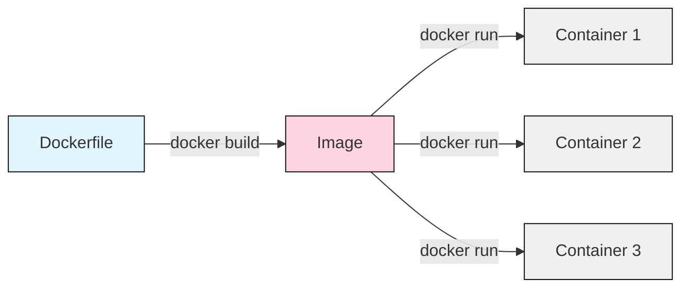

## List of Contents

- [[#The Setup]]
- [[#Writing The Dockerfile]]
- [[#Build The Image]]
- [[#Run The Container - Image]]
- [[#Delete Image]]

---

# The Setup

I want to create a docker **container** that is going to setup a Ubuntu container that's going to have my Neovim setup inside of it!

But before we can even start doing anything related to docker; we are going to have to setup our directory for writing the `Dockerfile`.

- Create a `docker-test` directory wherever you like ( *I have mine in my `~/Desktop` directory* ):

```bash
# create the 'docker-test' folder
cd ~/Desktop && mkdir docker-test
```

Then, create the `Dockerfile` inside and therefore your directory structure should look like this:

```console
 .
└──  Dockerfile
```

## The Flow

This is the process that we are going to take; from *creating* / *writing* the `Dockerfile` to *running* the **container**.



# Writing The Dockerfile

> [!INFO] Resource(s)
> - https://docs.docker.com/reference/dockerfile/
> - https://docs.docker.com/get-started/docker-concepts/building-images/

This is what I wrote inside my `Dockerfile`:

```dockerfile
# base image - Ubuntu Long Term Support
FROM ubuntu:24.04

# update, upgrade and install dependencies
RUN DEBIAN_FRONTEND=noninteractive apt-get update -y && \
  apt-get upgrade -y && \
  apt-get install -y \
  neovim \
  git \
  curl \
  wget \
  fd-find \
  ripgrep \
  build-essential \
  && apt-get clean \
  && rm -rf /var/lib/apt/lists/*

# create a non-root user
RUN useradd -m -s /bin/bash dockeruser

# switch to the newly created user
USER dockeruser

# create the `HOME` environment variable
ENV HOME=/home/dockeruser

# create the 'GitHub' folder
RUN mkdir -p $HOME/GitHub

# set working directory and clone dotfiles
WORKDIR $HOME/GitHub

# clone my dotfiles repository
RUN git clone https://github.com/Sunhaloo/dotfiles.git

# set up Neovim config
RUN mkdir -p $HOME/.config && \
  cp -r $HOME/GitHub/dotfiles/nvim $HOME/.config/nvim

# set Neovim as default editor
ENV EDITOR=nvim

# return to home directory
WORKDIR $HOME

# default command when container starts
CMD ["/bin/bash"]
```

Here are some things to remember:

- The `FROM` command is going to **set** the *base* image that will be used by our container
- The `RUN` command is going to **execute** any commands that we need to
- The `USER` command is going to allow us to perform **user** related actions
- The `WORKDIR` command is going to **switch** the working directory

> Well, the `ENV` command...

# Build The Image

> [!INFO] Resource(s)
> - https://docs.docker.com/build/concepts/dockerfile/#building

This is the command that we are going to run in order to **build** the `Dockerfile`.

- Make sure that you are in the same directory as the `Dockerfile`

```console
 .
└──  Dockerfile
```

- Run the actual build command:

```bash
# build the docker file into the image
docker build -t ubuntu-nvim-test:latest .
```

Now, even though that the command did **work**... Very Nice! It did give us a little *warning*:

```console
DEPRECATED: The legacy builder is deprecated and will be removed in a future release.
            Install the buildx component to build images with BuildKit:
            https://docs.docker.com/go/buildx/
```

- Check if our image has been built successfully:

```bash
# list all the images stored locally
docker images
```

- This is the output that I get after running the above command:

```console
ubuntu-nvim-test   latest    68657a1321aa   About a minute ago   503MB
ubuntu             24.04     c3a134f2ace4   5 weeks ago          78.1MB
```

# Run The Container - Image

Given that our **image** has been built correctly; we are now going to **run** it with the following command:

```bash
# run our image created ( to become a container )
docker run -it ubuntu-nvim-test:latest
```

> [!SUCCESS]
> My prompt changes from this:
>
> ```console
> [~/Desktop/docker-test]
> ```
>
> To the container running the *custom* Ubuntu image:
>
> ```console
> dockeruser@c4b51f32d798:~$
> ```

- Play with the docker container

```bash
# check the user name of the linux container
whoami

# list out all the folder(s) found inside the home directory
ls

# check the Neovim version
nvim --version
```

- This is the output that I get:

```console
dockeruser

GitHub  main.py

NVIM v0.9.5
Build type: Release
LuaJIT 2.1.1703358377

   system vimrc file: "$VIM/sysinit.vim"
  fall-back for $VIM: "/usr/share/nvim"

Run :checkhealth for more info
```

> Yes I did create that `main.py` file!

> [!WARNING]
> [LazyVim](https://www.lazyvim.org/) is **not** going to work as it requires a Neovim version of at least '0.11.2' ( *at the time of writing this* ).
>
> But as you can see the current Neovim version found for Ubuntu is '0.9.5'.
>
> > Hence, we won't be able to use LazyVim...
>

# Delete Image

The command that is used to delete an image is `docker image rm` or the shorter version ( *which I learned first* ) `docker rmi`.

> Therefore, we are going to use it to remove our `ubuntu-nvim-test` image.

- List out all the images present after creating the image:

```bash
# list al images present on local system
docker images
```

```console
REPOSITORY         TAG       IMAGE ID       CREATED         SIZE
ubuntu-nvim-test   latest    8af25dee0047   4 minutes ago   503MB
ubuntu             24.04     c3a134f2ace4   5 weeks ago     78.1MB
```

- Go ahead and run the following command:

```bash
# remove the created image
docker rmi ubuntu-nvim-test:latest
```

> [!WARNING] Ohh!
> This is the output that I get after I run the above `rmi` command:
>
> ```console
> Error response from daemon: conflict: unable to remove repository reference "ubuntu-nvim-test:latest" (must force) - container d34b7033b9db is using its referenced image 81607c44a1f2
> ```

> [!INFO] Fixing the deletion problem
> - First check if its being run in the background with this command:
>
> ```bash
> # check all running containers
> docker ps
> ```
>
> - As you can see, I don't have any **running** container:
>
> ```console
> CONTAINER ID   IMAGE     COMMAND   CREATED   STATUS    PORTS     NAMES
> ```
>
> - Let's check all container's status:
>
> ```bash
> # check all containers ( running and non-running )
> docker ps -a --filter ancestor=ubuntu-nvim-test:latest
> ```
>
> - Therefore you are going to see the container that we just ran:
>
> ```console
> CONTAINER ID   IMAGE                     COMMAND       CREATED              STATUS                          PORTS     NAMES
> d74fd140f28b   ubuntu-nvim-test:latest   "/bin/bash"   About a minute ago   Exited (0) About a minute ago             great_galileo
> ```
>
> - Delete the **container** itself using the following command:
>
> ```bash
> # delete the container that ran the 'ubuntu-nvim-latest' image
> docker rm great_galileo
> ```
>
> - You should see that it return the `NAMES` as output:
>
> ```console
> great_galileo
> ```
>
> > [!NOTE]
> > You have to use either the `CONTAINER ID` or `NAMES` when using the `docker rm` command.
> >
> > You **cannot** do something like:
> >
> > ```bash
> > # this is not possible ( as far as I know it )
> > docker rm ubuntu-nvim-test:latest
> > ```
>
> > [!TIP] Deleting The Image
> > Its now that we can go ahead and delete the `ubuntu-nvim-test:latest` image.
> >
> > - Therefore go ahead and run the following command:
> >
> > ```bash
> > # delete the image we created from the docker file
> > docker rmi ubuntu-nvim-test:latest
> > ```
> >
> > - This is the output that we get when we run the `rmi` command above:
> >
> > ```console
> > Untagged: ubuntu-nvim-test:latest
> > Deleted: sha256:a5fc44060538b0e52e7bfb912ad804975e8a2dd8f53b35c332f7da42dfe8763d
> > Deleted: sha256:c387cf88cbac0205c7c8321f85b2f8f1ebbf3ddddcd76831b403a35566233796
> > Deleted: sha256:820fc24736e7f696298837b5f47b63616432d5a37f42a83bc183165067564985
> > Deleted: sha256:7d66e02c0bec95da74f3c756931feb6ea90ea7481ce0bda680177d05babf010e
> > Deleted: sha256:654ca0a6850619921ad3c8d73638cea963cd01fdfa74a5561b64520c27e6e607
> > Deleted: sha256:ffdee9a0546e944fafd08fb8e436ff0767bccf2fdfe8945f3fe37375b04182f7
> > Deleted: sha256:993c45e918a0708ce5a1eb3222737e9d664aafb40d0ec6c9c3939f241692ae72
> > Deleted: sha256:38774fc50d9765e96c41e6efda8261c4850b53ec62a6fe8558c12b1cdd99a17b
> > Deleted: sha256:eaeb79988081d37d504054a0081b45921f060f99ccef1c3bb315231739cd483b
> > Deleted: sha256:12411bf3b1a79dd5ce1801cf219f260a049edeb790149d20b616d79e0e15d503
> > Deleted: sha256:3f4a418e47fcaa18a7e724aeaf281f4c163d2584f33c55edcf071cb54dba30a0
> > Deleted: sha256:e9af3f7c70668338ac251982d3ae62c3616ac6d0ca008618d82e77e9f032cacc
> > Deleted: sha256:4775fb1b8e57e6a160ae0ff0ac4a05e4865110ee156475bcbf25ecc410ffcda8
> > Deleted: sha256:aebc29f88824f340846df767ed2092988bbb021f4a413d75d69bf5526c753e74
> > Deleted: sha256:2962511e0381b57f33f2acd6d2d1e5774af3032ecb6d9d6ba87c230be7e164ac
> > Deleted: sha256:6b90c530e1edeec4e039fc27bc08ae118cf8f00241cc16deabe5b3b64318a0d1
> > ```
>

- List all the images present locally after deletion of `ubuntu-nvim-test:latest`:

```bash
# list al images present on local system
docker images
```

- As you can see we still have the base image called `ubuntu`:

```console
REPOSITORY   TAG       IMAGE ID       CREATED       SIZE
ubuntu       24.04     c3a134f2ace4   5 weeks ago   78.1MB
```

- Delete the `ubuntu` *base* image itself:

```bash
# delete the 'ubuntu' base package
docker rmi ubuntu:24.04
```

- Therefore you should see this:

```console
Untagged: ubuntu:24.04
Untagged: ubuntu@sha256:c35e29c9450151419d9448b0fd75374fec4fff364a27f176fb458d472dfc9e54
Deleted: sha256:c3a134f2ace4f6d480733efcfef27c60ea8ed48be1cd36f2c17ec0729775b2c8
```

---

# Socials

- **Instagram**: https://www.instagram.com/s.sunhaloo
- **YouTube**: https://www.youtube.com/@s.sunhaloo
- **GitHub**: https://www.github.com/Sunhaloo

---

S.Sunhaloo
Thank You!