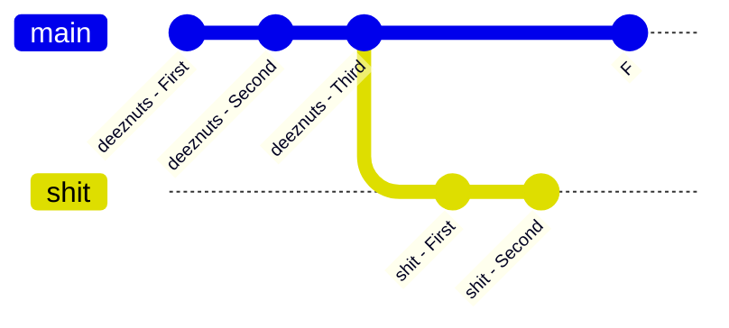
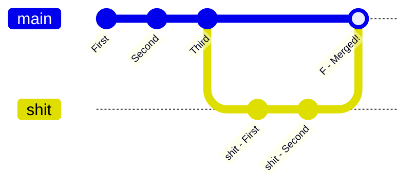
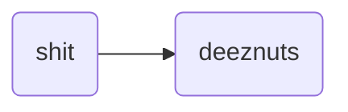
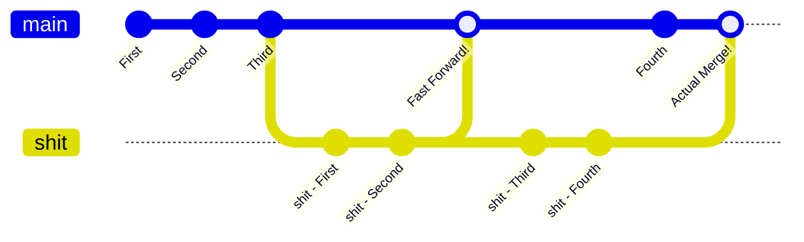

## List of Contents

- [[#Setting Up Repository for Merging]]
	- [[#Making Some Commits]]
	- [[#Git Adding, Committing]]
	- [[#Some More Changes]]
- [[#Creation Of Branch]]
	- [[#Making Changes and Commits in New Branch]]
	- [[#Make Some More Changes]]
- [[#Git - Merge]]
	- [[#Merging Branches]]
		- [[#Fast Forwarding]]
		- [[#Actually Merging Merging]]

---

# Setting Up Repository for Merging

> I think you know that the *literal* meaning of to "_**merge**_" means, right!

Currently, we don't have any other branch expect for our `deeznuts` branch. Therefore, let me go ahead and set us up to be able to learn how to **merge** branches in Git!

## Making Some Commits

Currently, I have these files in my **local** repository and also, only have 1 commit for `deeznuts`...

> "*[Hehe Boiiii](https://www.youtube.com/watch?v=Is4hy7gul_U)*"

- Running `eza -T --icons=always` ( *like I said, I use `eza` instead of `ls`* )

```console
 .
├──  joe_mama.txt
├──  main.py
└── 󰂺 README.md
```

- Running `git log --oneline --graph`

```console
* aea6060 Initial commit
```

- Running `git branch -a`

```console
* deeznuts
```

Hence, let's us change some stuff so that we can commit these changes.

- Modify our `main.py` file to become like this:

```python
# function that checks whether a string is palidrome
def palidrome(text: str = "nurses run"):
    return text.replace(" ", "").lower() == text.replace(" ", "").lower()[::-1]


# our main function
def main():
    # call the function to check if its working
    print(palidrome())
    print(palidrome("1001"))
    print(palidrome("amrot"))


# source the main function
if __name__ == "__main__":
    main()
```

- Modify our `joe_mama.txt` file to be like this:

```console
- https://www.youtube.com/@ThePrimeagen
- https://www.youtube.com/watch?v=dQw4w9WgXcQ
- https://www.youtube.com/watch?v=fFHlfbKVi30
```

## Git Adding, Committing

> This is literally one-quarter of Git!

- I am going to add all the changes / changed files to the *staging* area:

```bash
# add all changes to the staging area all at once
git add .
```

- Commit all the changes made using `-m` flag

```bash
# commit the changes by writing a simple message
git commit -m "Our Real Second Commit Ever"
```

> I know [my genius is sometimes frightening](https://www.youtube.com/watch?v=R8vlNbk0Yww)... *With these commit messages*!

- Therefore, running `git --no-pager log -1`, we should see that we made another commit

```console
commit bad0dd63891fb947f4afa4c4987c98201966498b
Author: Username <username@email.com>
Date:   Fri Aug 1 18:11:59 2025 +0400

    Our Real Second Commit Ever
```

## Some More Changes

Let us now make some another change to our repository. In this case, I am going to write something in the `README.md` file.

> You can write whatever the fuck you want!

- This is what I my updated `README.md` file looks like:

```console
# First Local Repository

This is my NOT my first local repository!!!

You can write whatever the fuck you want!
```

- Add and Commit the changes made:

```bash
# add the 'README.md' file to the staging area
git add README.md

# write a simple commit message with the '-m' flag
# NOTE: again, this is just for "show" don't do this
git commit -m "Update: Added Things To 'README.md' File"
```

- Verifying the commit with `git log -1`

```console
commit 085cbe9fd939d0e4f4b3de5061afabd8ace971b3
Author: Username <username@email.com>
Date:   Fri Aug 1 20:26:43 2025 +0400

    Update: Added Things to 'README.md' File
```

# Creation Of Branch

We are now going to create another branch named `shit`!

- Run the following command to **create** and **switch** to that new branch immediately

```bash
# create new branch 'shit' and switch to it instantly
git switch -c shit
```

> [!INFO] That's why you always RTFM!
> As this is the first time I am *actually* running the `switch` command with the `-c` flag. I by nature, ran `git help switch`... I found out that there is another **option** that we can pass to the `switch -c` command.
>
> ```console
> git switch [options] (-c|-C) new-branch [start-point]
> ```
>
> > There we have it the "*starting point*" option!
>
> Now what does this really mean? The thing is... When you run the command like so ( *without passing the "starting point"* ):
>
>
> ```bash
> # create new branch 'shit' and switch to it instantly
> git switch -c shit
> ```
>
> Git will assume that you want to start from the **last commit**! Again, you have to remember is on a *per-commit* basis.
>
> This means that if you wanted to create a new branch from you *first* commit... We can simply pass in the **SHA-1** value for the *first* commit!
>
> > Which in my case it looks something like this ( *BTW I am going to create temporary `test` branch just to show you this* )!
>
> ```bash
> # create a new branch 'test' and immediately switch to it
> # this branch will / should start from the first commit ever!
> git switch -c test aea6060a504ed9dab225edbe3995553142f4df1e
> ```
>
> - Running the `git branch -a` command, we can see that we are in `test` branch
>
> ```console
>  deeznuts
>  shit
> * test
> ```
>
> - Running the `git log` command, we can see that we started from the *first* commit from the `deeznuts` branch.
>
> ```console
> commit aea6060a504ed9dab225edbe3995553142f4df1e
> Author: Username <username@email.com>
> Date:   Wed Jul 30 17:46:00 2025 +0400
>
>    Initial commit
>    
>    This is our very first commit which contains the following files:
>    
>    - README.txt
>    - joe_mama.txt
>    - main.py
>    
>    Peace out!
> ```
>
> As you can see, we only have this commit which this branch is based on!
>
> ---
>
> - Deleting the temporary `test` branch ( *because I am a good citizen* ):
>
> ```bash
> # delete the temporary branch
> git branch -d test
> ```
>
> > [!SUCCESS]
> > ```bash
> > * deeznuts
> >  shit
> > ```
> >
> > > No `test` branch here [Knjiga](https://languagedrops.com/word/en/english/croatian/translate/book/)!
> >
>

## Making Changes and Commits in New Branch

Now, making sure that you are in the `shit` branch! We are now going to make some *shitty* changes.

I am now going to add the following words to my `README.md` file

```console
[Tone kaka... P senti kaka la](https://www.tiktok.com/@kawoa8/video/7463483594573384966)
```

> I don't condone fucking Tik fucking Tok!

- So running the usual `add` and `commit`

```bash
# add the 'README.md' file to the staging area
git add README.md

# write a little commit message directly in the terminal
git commit -m "A: Added Memes"
```

- Running `git log -1` should give us our latest commit

```console
commit 6ad5857b36eec80ea183512a42555b9445ae2b35
Author: Username <username@email.com>
Date:   Fri Aug 1 21:24:10 2025 +0400

    A: Added Memes
```

## Make Some More Changes

> I think you get the idea by now!

- Add the following line to our `joe_mama.txt`

```console
Ligma Balls Meme: https://www.youtube.com/watch?v=VYyjNx-kEdw
```

- Same thing really, `add` and `commit`!

```bash
# add the 'joe_mama.txt' file to the staging area
git add joe_mama.txt

# write a little commit message directly in the terminal
# WARNING: See how these commit messages does not have any meaning
# don't do that specially if you are working with people
git commit -m "A: Added More Memes"
```

- Again, running the little `git log -1` command, we should see that we made that commit:

```console
commit b7ef205fab5b8e35756027ec575c3212e8173f9f
Author: Username <username@email.com>
Date:   Fri Aug 1 21:32:47 2025 +0400

    A: Added More Memes
```

# Git - Merge

> Fucking Finally... $\longleftarrow$ "*I am saying this for myself BTW*"
> In this shitty world... You gotta have to express you opinion mate! ( *don't do that BTW*! )

Now, give that we have these 2 separate branches and we want to *add* the contents **of** branch *`shit`* **to** *`deeznuts`*.

This is the current situation of our branches:



But now I want to do this:



> Let's go ahead and actually do it!

> [!BUG]
> I don't really know how we can change the **initial** `main` branch in / with [mermaid](https://mermaid.js.org/).
>
> But you know... `deeznuts`!!!
>
> > "*That's what she said*"!
>

## Merging Branches

### Fast Forwarding

Okay, what we really want is this:



Hence, to be able to properly do this... Follow the following commands below:

- Switch to our `deeznuts` Branch

```bash
# switch to our 'deeznuts' branch
git switch deeznuts
```

- Merge the *contents* **from** `shit` to `deeznuts`

```bash
# merge the 'shit' branch's content to 'deeznuts'
git merge shit
```

- This is the output that I get just after running the `merge` command inside our `deeznuts` branch:

```console
Updating 085cbe9..b7ef205
Fast-forward
 README.md    | 2 ++
 joe_mama.txt | 1 +
 2 files changed, 3 insertions(+)
```

---

#### Contents Of Files In `deeznuts` Branch

- `README.md` File:

```console
# First Local Repository

This is my NOT my first local repository!!!

You can write whatever the fuck you want!

[Tone kaka... P senti kaka la]
(https://www.tiktok.com/@kawoa8/video/7463483594573384966)
```

- `joe_mama.txt` File:

```console
- https://www.youtube.com/@ThePrimeagen
- https://www.youtube.com/watch?v=dQw4w9WgXcQ
- https://www.youtube.com/watch?v=fFHlfbKVi30

- Ligma Balls Meme: https://www.youtube.com/watch?v=VYyjNx-kEdw
```

> [!SUCCESS]
> As you can see, both files have been updated correctly!

---

But let's try something that I want to see...Try running the following command found be in the **`deeznuts`** branch!

```bash
# check if we have "diagonal" lines in log graphs
git log --oneline --graph
```

```console
* b7ef205 (HEAD -> deeznuts, shit) A: Added More Memes
* 6ad5857 A: Added Memes
* 085cbe9 Update: Added Things to 'README.md' File
* bad0dd6 Our Real Second Commit Ever
* aea6060 Initial commit
```

> Ohh... No Diagonal Lines!? But everything is correct!

> [!NOTE] Reason For Fast-Forwarding
> So the reason for **fast-forwarding** ahead is simply because we did <strong> <span style="color: red;"> not</span> </strong> make any *changes* to our `deeznuts` branch!
>
> Because remember we created the `shit` branch based on this commit:
>
> ```console
> commit 085cbe9fd939d0e4f4b3de5061afabd8ace971b3
> Author: Username <username@email.com>
> Date:   Fri Aug 1 20:26:43 2025 +0400
>
>    Update: Added Things to 'README.md' File
> ```
>
> But then we did **not** *change* anything inside our `deeznuts` branch. We only made 2 commits to the branch `shit` itself!
>
> Therefore, when Git sees that it the original branch that `shit` was based on is still "*intact*"... It just '**fast-forwards**' it!
>
> Now, you could say that we did not really need that `shit` branch! As we could have made those exact changes to our `deeznuts` branch itself!
>
> Also, long story short... Git does this so as to **improve** performance and also to keep the *size* of the `.git/` directory "*light*" enough!

> [!WARNING]
> Now, I did not know this initially. But you do have the option to run merge with the following flags: `--ff`, `--no-ff`, `--no-ff-only`.
>
> Therefore, if I wanted to show the "*diagonal*" lines when running the `git log --oneline --graph` command. I could have instead used the following ( *see below* ) command instead of simply merging them.
>
> ```bash
> # run the merge commit and explicitly mention NO fast-forwarding!
> # INFO: again if you want 'shit' --> 'deeznuts'
> #need to run command in 'deeznuts'
> git merge --no-ff shit
> ```
>
> > Then running the `log` command with `--graph` should show these "*diagonal*" lines!
>

### Actually Merging Merging

> My Wonderful, Splendid English!

So I really want to see these diagonal lines like I have in my private repository

> This is what I have in my private repository

```console
* 6dfc1d2 (origin/UOM_L1_COMPLETE, UOM_L1_COMPLETE) Lrf, V ubcr Lrne 2 r orggre
* c1f68b0 V nz abj tbvat vagb Lrne 2
| * 8b93fbf (origin/UOM_L1S2) Hcqngr: V gevrq gb ybpx va Frzrfgre 2... Gevrq!
|/
* 5f85675 (HEAD -> main, origin/main, origin/HEAD) Frr Lbh Yngre
```

> As you can see there is that "*diagonal*" line that I was talking about!

Let us now **switch** to our `shit`ty branch and again makes somes random little changes to it.

- Switch to the `shit` branch if you we inside `deeznuts`

> Is that a "*That's what she said moment*"? I don't even know anymore...

```bash
# switch to our 'shit' branch for some shitty actions
git switch shit
```

- Adding this line at the bottom of my `joe_mama.txt` file

```console
Switch to Linux... I mean, you can even just use WSL!
Its going to be so much fun!!!
```

> Ohh did I mention that VIM / Neovim is the Greatest Editor of All Time?
> Here are my dotfiles: https://github.com/Sunhaloo/dotfiles

- Commit the changes made to `shit` branch

```bash
# add the required file to the staging area
git add joe_mama.txt

# commit the changes without opening editor
git commit -m "A: Switch to Linux Line Added"
```

> You know what let's also make another commit adding a simple *comment* inside our `main.py` file

- Adding the following line at the top of the `main.py` file

```py
# CS = C and C = CS
```

- Again, proceed to stage and commit the changes made

```bash
# add the required file to the staging area
git add main.py

# commit the changes without opening editor
git commit -m "A: Required Comments"
```

Let us now go back to `deeznuts` and make a change inside the **same** `joe_mama.txt` file.

- Switching to `deeznuts` branch

```bash
# switch to your lovely `deeznuts` branch
git switch deeznuts
```

- Add the following to our `joe_mama.txt` file

```console
Nice One: https://www.youtube.com/watch?v=GcPO59vyjzI
```

> [!NOTE]
> This `joe_mama.txt` will **not** contain the 2 lines that we typed out when we are inside our `shit` branch.

- Same thing again, commit the changes that we made inside `deeznuts`!

```bash
# add the required files to the staging area
git add joe_mama.txt

# commit the changes made
git commit -m "A: YouTube Link"
```

---

#### Comparing Latest Commits

This is what the latest *commit hash* for our `shit` branch looks like **right now**:

```console
8c4d637420c7ff271089f117aedf36424f834bbc
```

And this is what the latest *commit hash* for our `deeznuts` branch looks like **right now**:

```console
3a50ec8739e5b62d254d790b8a2362854a22fceb
```

Back when `shit` branch was first created... It was based on this commit:

```console
085cbe9fd939d0e4f4b3de5061afabd8ace971b3
```

Like I have been saying, back then **no** changes were made to our `deeznuts` branch. Therefore, the latest commit for `deeznuts` was... Well the **same**!!!

> Again, that's the fucking reason as to why Git **fast-forwarded**.

But now we can clearly see that we have 2 different commits! So fingers *crossed* that it will now be an actual / "*real*" merge!

---

Therefore, to get the contents of `shit` into `deeznuts`... We first need to make sure that we are in `deeznuts`!

- Make sure that we are inside `deeznuts`

> "*Hehe*" I know know... I am immature! But what's the point of not having fun!

```bash
# switch to our "main" 'deeznuts' branch
git switch deeznuts
```

- Merge `shit` branch with the `deeznuts` branch

```bash
# merge the contents of 'shit' with 'deeznuts'
git merge shit
```

> [!BUG] Oh Oh Oh Fuck. A **Conflict**!
> ```console
> Auto-merging joe_mama.txt
> CONFLICT (content): Merge conflict in joe_mama.txt
> Automatic merge failed; fix conflicts and then commit the result.
> ```
> Right now we have a **conflict** and with conflicts, we have some things that we can do:
>
> 1. Keep one side
> 2. Combine both
> 3. Complete re-write
>
> But I want to **keep both sides**!
>
> If you go ahead and open the `joe_mama.txt` file, you are going to see this:
>
> ```console
> - https://www.youtube.com/@ThePrimeagen
> - https://www.youtube.com/watch?v=dQw4w9WgXcQ
> - https://www.youtube.com/watch?v=fFHlfbKVi30
>
> - Ligma Balls Meme: https://www.youtube.com/watch?v=VYyjNx-kEdw
>
> <<<<<<< HEAD
> Nice One: https://www.youtube.com/watch?v=GcPO59vyjzI
> =======
> Switch to Linux... I mean, you can even just use WSL!
> Its going to be so much fun!!!
> > > > > > > > shit
> ```
>
> To **combine** both of our commits and "*save*" everything, we are going to modify `joe_mama.txt` to this:
>
> ```console
> - https://www.youtube.com/@ThePrimeagen
> - https://www.youtube.com/watch?v=dQw4w9WgXcQ
> - https://www.youtube.com/watch?v=fFHlfbKVi30
>
> - Ligma Balls Meme: https://www.youtube.com/watch?v=VYyjNx-kEdw
>
> Nice One: https://www.youtube.com/watch?v=GcPO59vyjzI
> Switch to Linux... I mean, you can even just use WSL!
> Its going to be so much fun!!!
> ```
>
> Now, we need to "*stage*" these changes... Therefore, run our lovely little `add` command:
>
> ```bash
> # add the text file to the staging area
> git add joe_mama.txt
> ```
>
> - We are now going to `commit`:
>
> ```bash
> # simply run this command and your editor will open
> # you should already see that the 'commit message'
> # has been automatically populated for you
> git commit
> ```
>
> > [!SUCCESS]
> > The *conflict* has been **fixed**! The **merging** will now continue with its execution!
>

- This is the message that I get after `merge` was done:

```console
[deeznuts 2e58862] Merge branch 'shit' into deeznuts
```

- Running our `git log --oneline --graph`, we can now see that we have:

```console
*   2e58862 Merge branch 'shit' into deeznuts
|\  
| * 8c4d637 A: Required Comments
| * 8249496 A: Switch to Linux Line Added
* | 3a50ec8 A: YouTube Link
|/  
* b7ef205 A: Added More Memes
* 6ad5857 A: Added Memes
* 085cbe9 Update: Added Things to 'README.md' File
* bad0dd6 Our Real Second Commit Ever
* aea6060 Initial commit
```

> Our *beautiful* diagonal lines!

---

#### Contents Of "Changed" Files

- This is how our current `main.py` file looks like:

```console
# CS = C and C = CS
# function that checks whether a string is palidrome
def palidrome(text: str = "nurses run"):
    return text.replace(" ", "").lower() == text.replace(" ", "").lower()[::-1]


# our main function
def main():
    # call the function to check if its working
    print(palidrome())
    print(palidrome("1001"))
    print(palidrome("amrot"))


# source the main function
if __name__ == "__main__":
    main()
```

- This is how our current `joe_mama.txt` file looks like:

```console
- https://www.youtube.com/@ThePrimeagen
- https://www.youtube.com/watch?v=dQw4w9WgXcQ
- https://www.youtube.com/watch?v=fFHlfbKVi30

- Ligma Balls Meme: https://www.youtube.com/watch?v=VYyjNx-kEdw

Nice One: https://www.youtube.com/watch?v=GcPO59vyjzI
Switch to Linux... I mean, you can even just use WSL!
Its going to be so much fun!!!
```

> [!SUCCESS] Again "*SUC Fucking CESS*"!
> As you can see we have successfully **added** the contents from our `shit` branch to our `deeznuts` branch!

> This is how our branches currently looks like:




---

# Socials

- **Instagram**: https://www.instagram.com/s.sunhaloo
- **YouTube**: https://www.youtube.com/@s.sunhaloo
- **GitHub**: https://www.github.com/Sunhaloo

---

S.Sunhaloo
Thank You!