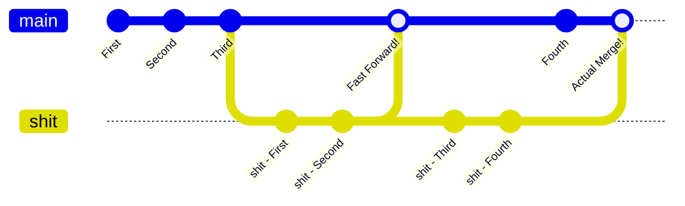
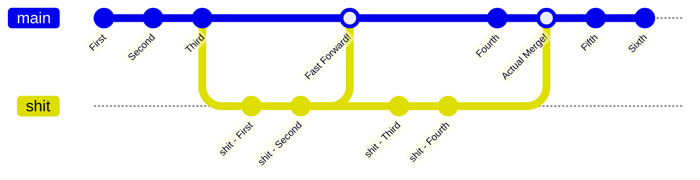
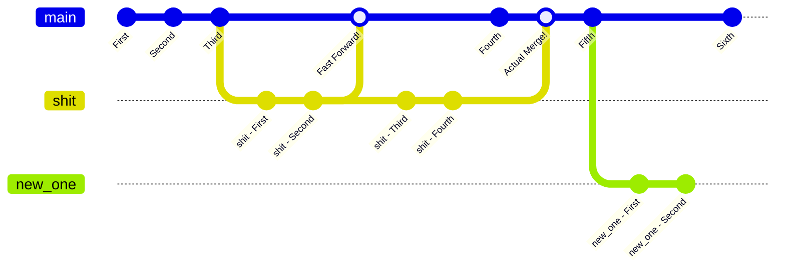
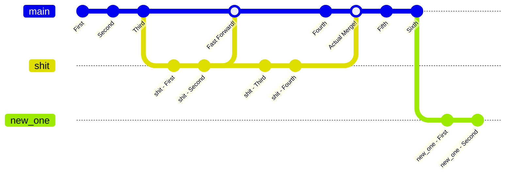
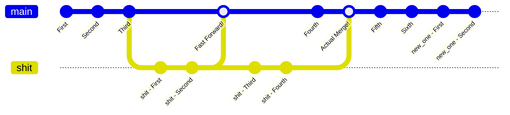

## List of Contents

- [[#Preparing Repository For Rebasing]]
	- [[#Creating A New Branch]]
	- [[#Let's Create Some Commits]]
- [[#Git - Rebase]]
	- [[#Actually Rebasing]]
		- [[#Running The Commands]]
		- [[#What If We Rebase Again "Main"]]
- [[#But Be Careful]]

---

> [!INFO]
> I have something to say... So as you know this is **not** my first time using Git.
>
> I created my first ever repository on 22nd March of 2021!
>
> But like I have been asking myself: "*Do I know Git*?"
>
> These are **my** notes and I am not really making this for anyone. The way that I write notes, which I know is weird, because it looks like I am making it for people to read.
>
> Therefore, basic things like `log`, `commit` and "*the meaning / action*" of `merge`. Therefore, I am not really making a "*tutorial from scratch*" per se... But really its just my notes.
>
> Therefore, I **fully** expect you to **not** understand a single thing that I have been typing!

> [!INFO] Resources
> - https://www.youtube.com/watch?v=f1wnYdLEpgI
> - https://www.youtube.com/watch?v=zOnwgxiC0OA
> - `git help rebase` ( *obviously*!!! )

Reading and watching videos online. There is a huge *debate* as to whether `merge` is **better** than `rebase` or **vice-versa**!

But I don't really care about the debate. Remember, us programmers, for example, a language is **just a fucking tool**... It you are trying to unscrew a *slotted screw* with a *philips screwdriver* then you are not using the right tool for the job.

> This also applies to things like "*What language should I learn*?"
> The question should be "*What am I trying to build*?", "*What is the best tool for building it*?"

> [!TIP]
> In the video [above](https://www.youtube.com/watch?v=zOnwgxiC0OA&t=555s), it said something that I agree with given the **advantages** and **disadvantages** with `rebase`.
>
> Use `rebase` to stay **updated** with `main` branch but use `merge` to *actually* merge with your `feature` branch with the `main` branch or vice-versa.
>
> This is because of how **commit history** gets treated with each of the commands.
>
> > [!NOTE]
> > Like he said in the video; as people "*hate*" `rebase`. Some repositories that you can see on GitHub does **not** even allow you to use the `rebase` command ( *from what I understand* ).
>

> Well I want to get started with it now!

---

# Preparing Repository For Rebasing

Now, you know that afer our little [[Git - Merge | `git merge`]] adventure. Our **local** repository is looking like this:



Now, we are going to have to "*prepare*" our repository so that I can actually try to run the `rebase` command.

Right now, I am going to make **2** more commits to our `deeznuts` branch!

- Go ahead and write something into our `README.md` file

```console
I have lost all faith in humanity!!!
Life back then was better... Actual improvements where being made.
```

- You know the deal by now! Run "*half*" of Git's "*workflow*" Commands!

```bash
# add the 'README.md' file to the staging area
git add README.md

# commit the changes made
git commit -m "I Like Cars"
```

- Running a little `git log -1`, we see that we have successfully committed:

```console
commit 7e3edc9360b6a4544ca7badcf57ceb72f0b657b7
Author: Username <username@email.com>
Date:   Sat Aug 2 19:02:07 2025 +0400

    I Like Cars
```

- Remember this very *commit hash* as we are going to be using it!

```console
7e3edc9360b6a4544ca7badcf57ceb72f0b657b7
```

- We are now going to make another commit... Add this to the `README.md` file

```console
"Fuck Society!" Mr Robot
```

- Do I need to say something here... Why are you reading this?

```bash
# add the required file to the lovely staging area
git add README.md

# commit the changes made
git commit -m "The RX-7 FD goes brap brap brap brap"
```

- Again, checking the "*logs*", we should see that we now have:

```console
commit e404d326e697e9f94842c545486a310522cdd7c0
Author: Username <username@email.com>
Date:   Sat Aug 2 19:06:37 2025 +0400

    The RX-7 FD goes brap brap brap brap
```

> Our current situation looks like this:



## Creating A New Branch

Remember that *commit hash* that I said you need to remember? Well, we are now going to use it to create a **new branch** at that "*starting point*".

- Creation of new `new_one` branch

```bash
# create branch 'new_one'
# based on our "fifth" commit on 'deeznuts' ( hehe )
# immediately switch to that branch after creation
git switch -c new_one 7e3edc9360b6a4544ca7badcf57ceb72f0b657b7
```

- Check that we are on the right branch with `git branch`:

```console
  deeznuts
* new_one
  shit
```


- Simply run the `git log -1` command and you **should** see that the above commit **is** the *last* one!

```console
commit 7e3edc9360b6a4544ca7badcf57ceb72f0b657b7
Author: Username <username@email.com>
Date:   Sat Aug 2 19:02:07 2025 +0400

    I Like Cars
```

> [Must Be The Water](https://www.youtube.com/watch?v=w4vj0ciF-SQ)

### Let's Create Some Commits

Yeap! let's do the thing that is called "*Half of Git*" again!

- First, let's change something inside our `joe_mama.txt` file

> Add this to the top of the file!

```console
I don't want to any more conflicts
```

- Give is the `add`, `commit` treatment:

```bash
# add the 'joe_mama.txt' file to the staging area
git add joe_mama.txt

# commit the changes that we made
git commit -m "I don't want conflict... Fingers Crossed"
```

- Run the checker... `git log -1`:

```console
commit e5cff4b093c2059647d8637bfd2b08bf440c9a81
Author: Username <username@email.com>
Date:   Sat Aug 2 21:22:01 2025 +0400

    I don't want conflict... Fingers Crossed
```

- Our second little change will be in `README.md`...

> Go ahead and **remove** the line consisting of this sentence:

```console
You can write whatever the fuck you want!
```

- [Hit It](https://www.youtube.com/watch?v=ALXCF2PoYpQ&t=58s) with the `add` and `commit` again:

```bash
# add the required file to the staging area
git add README.md

# commit the changes
git commit -m "Remove a line from Markdown File"
```

- Check if we committed successfully `git log -1`:

```console
commit 4644d25823e5b3476834210807d9cadff1e9fd71
Author: Username <username@email.com>
Date:   Sat Aug 2 21:40:41 2025 +0400

    Remove a line from Markdown File
```

This is how, **diagrammatically**, our branches are looking like right here, right now:



# Git - Rebase

## [Listen To My Sweet Posh Upper Class Accent](https://www.youtube.com/watch?v=UKrwnPEKi5c&t=113s)

We are now going to use the `rebase` command. But before that we need to learn some English!

So let's say that we are **currently** in the `new_one` branch. Now if we are going to "*apply*" the `rebase` command so that it does its "*things*" ( *be patient, I am going to show you* ).

Therefore, we say that we are:

> "*Rebasing*" **against** the `deeznuts` branch!

But if we were on the `deeznuts` branch and we ran the `rebase` command... We say:

> "*Rebasing*" **against** the `new_one` branch!

## Actually Rebasing

I think you get the idea of '*where*' we are currently situated "*diagrammatically*". Therefore, let me first explain to you what its going to happen.

- We should be going from this:


- To this ( *hopefully* ):



> Its that simple in terms of understanding it!

That the thing about the `rebase` command. We are just "*rebasing*" ( *like 'base'; like a Minecraft 'base'* ) where out `feature` branch will be.

- First run another version of `log` command:

```bash
# run another version 'git log'
git log --oneline --graph --all
```

- Therefore, we should see that we have some "*divergence*":

```console
* 4644d25 Remove a line from Markdown File
* e5cff4b I don't want conflict... Fingers Crossed
| * e404d32 The RX-7 FD goes brap brap brap brap
|/  
* 7e3edc9 I Like Cars
*   2e58862 Merge branch 'shit' into deeznuts
|\  
| * 8c4d637 A: Required Comments
| * 8249496 A: Switch to Linux Line Added
* | 3a50ec8 A: YouTube Link
|/  
* b7ef205 A: Added More Memes
* 6ad5857 A: Added Memes
* 085cbe9 Update: Added Things to 'README.md' File
* bad0dd6 Our Real Second Commit Ever
* aea6060 Initial commit
```

### Running The Commands

- Make sure that we are currently located inside the `new_one` branch:

```bash
# switch to the 'new_one' branch
git switch new_one
```

- Verify that if we have actually switch to it with `git branch`:

```console
  deeznuts
* new_one
  shit
```

- Run the *rebase* command:

```bash
# rebase against 'deeznuts' branch
git rebase deeznuts
```

- You should see that ( *there should be no conflicts and that* ) we get this output message:

```console
Successfully rebased and updated refs/heads/new_one.
```

- Running a little `git log --oneline --graph --all` from our `new_one` branch, we see this:

```console
* 8620b27 Remove a line from Markdown File
* 58cce6e I don't want conflict... Fingers Crossed
* e404d32 The RX-7 FD goes brap brap brap brap
* 7e3edc9 I Like Cars
*   2e58862 Merge branch 'shit' into deeznuts
|\  
| * 8c4d637 A: Required Comments
| * 8249496 A: Switch to Linux Line Added
* | 3a50ec8 A: YouTube Link
|/  
* b7ef205 A: Added More Memes
* 6ad5857 A: Added Memes
* 085cbe9 Update: Added Things to 'README.md' File
* bad0dd6 Our Real Second Commit Ever
* aea6060 Initial commit
```

> As you can see, the *commit history* is **linear**!

- Additionally, running the same `log` command but this time inside of `deeznuts`:

```console
* 8620b27 Remove a line from Markdown File
* 58cce6e I don't want conflict... Fingers Crossed
* e404d32 The RX-7 FD goes brap brap brap brap
* 7e3edc9 I Like Cars
*   2e58862 Merge branch 'shit' into deeznuts
|\  
| * 8c4d637 A: Required Comments
| * 8249496 A: Switch to Linux Line Added
* | 3a50ec8 A: YouTube Link
|/  
* b7ef205 A: Added More Memes
* 6ad5857 A: Added Memes
* 085cbe9 Update: Added Things to 'README.md' File
* bad0dd6 Our Real Second Commit Ever
* aea6060 Initial commit
```

> As you can see we have the same thing!

### What If We Rebase Again "Main"

But what if we switch to the `deeznuts` branch and then run the `rebase` command?

> Well, there's only one way find out!

- Switch to our `deeznuts` branch and make sure that we are "*inside*" it:

> "*That's what she said*!"

```bash
# switch to our "main" 'deeznuts' branch
git switch deeznuts

# check if we are actually inside the correct branch
# INFO: not a mistake... run the fucking command again
git switch deeznuts
```

- This is the "*error*" message that we get:

```console
Already on 'deeznuts'
```

> Now that a good "*That's what she said*"... We are good to go!

- Run the `rebase` command here:

```bash
# rebase against our "main" / 'deeznuts' branch
git rebase new_one
```

> I am expecting **some** *conflicts*!

- This is the output after running the above `rebase` command:

```console
Successfully rebased and updated refs/heads/deeznuts.
```

> Lovely! No *conflicts*

- Checking the commits with `git log --oneline --graph --all` ( *ran inside `deeznuts` obviously...* ):

```console
* 8620b27 Remove a line from Markdown File
* 58cce6e I don't want conflict... Fingers Crossed
* e404d32 The RX-7 FD goes brap brap brap brap
* 7e3edc9 I Like Cars
*   2e58862 Merge branch 'shit' into deeznuts
|\  
| * 8c4d637 A: Required Comments
| * 8249496 A: Switch to Linux Line Added
* | 3a50ec8 A: YouTube Link
|/  
* b7ef205 A: Added More Memes
* 6ad5857 A: Added Memes
* 085cbe9 Update: Added Things to 'README.md' File
* bad0dd6 Our Real Second Commit Ever
* aea6060 Initial commit
```

- We can even see that we have the changes inside `joe_mama.txt`:

```console
I don't want to any more conflicts

- https://www.youtube.com/@ThePrimeagen
- https://www.youtube.com/watch?v=dQw4w9WgXcQ
- https://www.youtube.com/watch?v=fFHlfbKVi30

- Ligma Balls Meme: https://www.youtube.com/watch?v=VYyjNx-kEdw

Nice One: https://www.youtube.com/watch?v=GcPO59vyjzI
Switch to Linux... I mean, you can even just use WSL!
Its going to be so much fun!!!
```

This can be diagrammatically represented like so:



---

#### Make A Change And Commit

Now let's go ahead make a simple change to our files located on the `deeznuts` branch and we should have no errors.

- Add the following line into the `README.md` file:

```console
We did it boys
```

- Y'all know this shit by now, right? Right?

```bash
# stage the required file
git add .

# commit the changes without opening the editor
git commit -m "We should be linear now boys... and girls"
```

- Therefore, running `git log -1`... We should see that we have:

```console
commit 8c895c93a2584e353ffc665aede062ac84878e9b
Author: Username <username@email.com>
Date:   Sat Aug 2 23:40:18 2025 +0400

    We should be linear now boys... and girls
```

> [!SUCCESS]
> Yes! Yes! Yes!
>
> > "*That's what she said*"
>
> We did it... [We are the champions](https://www.youtube.com/watch?v=04854XqcfCY)!

---

# But Be Careful

Please do watch the video that I linked above...

> [!TIP]
> - Use `rebase` to stay updated with the `main` **remote** branch
> - Use `merge` to actually merge your `feature` branch with `main`

That all that I have to say...

---

# Socials

- **Instagram**: https://www.instagram.com/s.sunhaloo
- **YouTube**: https://www.youtube.com/@s.sunhaloo
- **GitHub**: https://www.github.com/Sunhaloo

---

S.Sunhaloo
Thank You!