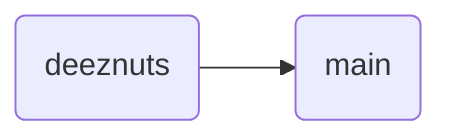

## List of Contents

- [[#Remote Repositories]]
- [[#Local Remote Repository]]
	- [[#Add Original Repository As Remote]]
- [[#Git - Push and Git - Pull]]
	- [[#Git - Push]]
		- [[#Not Compatible With Local Remotes]]
- [[#GitHub]]
	- [[#But Before That]]
		- [[#SSH Keys]]
	- [[#Git - Clone]]
		- [[#Cloning Repository]]
	- [[#Creation of `first_local_repo` on GitHub]]
		- [[#Git Push | Actually Pushing]]
- [[#Having Fun!]]
	- [[#Clone Repository Again]]
	- [[#Makes Some Commits in Original Repository]]
- [[#Git Ignore Files]]
	- [[#Ignore Some Files]]

---

# Remote Repositories

When most of us ( *even I* ) think about **remote** repositories... I think about how that *local* repositories is being hosted on platforms such as [GitHub](https://github.com), [GitLab](https://about.gitlab.com/) and others.

The thing is we can make our `first_local_repo` act like a "*remote*" repository if we wanted to and this is what I am going to be showing *me*, *myself* and *I* first then we are going to move onto GitHub and *remote hosting*.

# Local Remote Repository

My current working path looks like this:

```console
/home/username/Desktop/learning_git/first_local_repo
```

Let's head back one level and create a new directory / folder called `first_local_repo_local`.

```bash
# head back into the 'learning_git' folder
cd ..

# make another folder with the correct name
mkdir first_local_repo_local
```

- Therefore, our `learning_git` directory should contains these 2 folders:

> Again, I use `eza` instead of `ls`

```console
 .
├──  first_local_repo
│──  first_local_repo_local
```

As you can see, we don't have anything inside our new folder and we can confirm this with `du -sh` command:

```console
4.0K	first_local_repo_local
```

## Add Original Repository As Remote

Head into that new folder `first_local_repo_local` that we just made and let's set it up.

> Hopefully, you know how to change directories

- Setup the new repository

```bash
# setup the "initial" git repository
git init
```

- You should see that we have successfully initialise this *new* repository

```console
Initialized empty Git repository in
/home/Username/Desktop/learning_git/first_local_repo_local/.git/
```

> [!NOTE]
> Now I thought that we just need to run the command found below and it would have run the `git init` command automatically for us.
>
> > But I guess I was <span style="color: orange;"> wrong</span> !!!
>
> > [!INFO]
> > I think its okay to make, lots and lots of mistakes else we would be "*Gods*" on Earth...
> >
> > > Now I am not telling you to go and kill someone... But I mean you can... *In game*.
> >
>

- Run the following command to setup `first_local_repo_local` as "*local*" repository

```bash
# track the remote repository 'first_local_repo'
# whereby the remote name is "origin"
# which points to local folder 'first_local_repo'
git remote add origin ../first_local_repo
```

> [!WARNING]
> You will **not** get an *output* messages when you run this command!
>
> But if you go ahead and run the **same** command again, you should see that we get the following *error* message:
>
> ```console
> error: remote origin already exists.
> ```

> [!INFO] What Did We Just Do?
> So like I have said, we have our **first** `first_local_repo` that is going to now act as a **remote** repository.
>
> Now, our `first_local_repo_local` is now going to be considered as our *actual* "_**local**_" repository.
>
> Running the above command we are simply saying to Git that:
>
> > "*Yo! we are going to link `first_local_repo_local` with `first_local_repo`*"
>
> But the, Git is going to ask us some questions like... "*What do you want the 'remote' repository*?" to be called and "*Where is that 'remote' repository actually located at*?"
>
> Hence, `git remote add origin ../first_local_repo` whereby the **name** is going to be `origin` ( *default name convention that everybody in their mother uses* ) and the **location** ( *in this case* ) is going to be `../first_local_repo`.

### The Problem

Okay, so we have told Git that... Okay there is going to be a **link** between these repositories. But where are our files?

Yes, currently the **new** *local* repository is completely empty!

- Check if there are any objects:

```bash
# check if we have any objects inside the new repository
ls .git/objects
```

- As you can see, just 2 **empty** folders:

```console
 info  pack
```

- But what about a `git log`:

```console
fatal: your current branch 'main' does not have any commits yet
```

- Okay, let's try a `git branch -la`:

```console

```

> I think you are getting my point!

Yes, even if we have created an *initial connection* between the 2 repositories. There are **no** files that are currently present.

### The Solution To The Problem

> [!INFO] "*RTFM*" and Resources
> - `git help fetch`
> - https://www.youtube.com/watch?v=T13gDBXarj0

#### Linking Information

So to get the information from our **remote** repository `first_local_repo` into our *local* repository `first_local_repo`... We are going to use this very command right here:

```bash
# download the objects and references from another repository
git fetch
```

- Running the following command will output something like this:

```console
remote: Enumerating objects: 45, done.
remote: Counting objects: 100% (45/45), done.
remote: Compressing objects: 100% (44/44), done.
remote: Total 45 (delta 14), reused 0 (delta 0), pack-reused 0 (from 0)
Unpacking objects: 100% (45/45), 4.86 KiB | 355.00 KiB/s, done.
From ../first_local_repo
 * [new branch]      deeznuts   -> origin/deeznuts
 * [new branch]      new_one    -> origin/new_one
 * [new branch]      shit       -> origin/shit
```

> [!NOTE]
> There is still **nothing** inside our `first_local_repo_local`'s **`main`** branch ( *we cannot even `git log`* )... But we do now have this:
>
> ```bash
> # run the little 'branch' command
> git branch -la
> ```
>
> Therefore, we should have these:
>
> ```console
>  remotes/origin/HEAD -> origin/deeznuts
>  remotes/origin/deeznuts
>  remotes/origin/new_one
>  remotes/origin/shit
> ```

#### Check The Logs

Now, we all know that the `log` command will show us the commits that we make inside a repository, right!

But I did not know this... It can even show us the *commits* that are made **from** the *remote* repository also!

- Check the *commits* made inside the `shit` branch

```bash
# check the remote commit logs for 'shit' branch
git log origin/shit
```

> Well... You **should** see that all the *commits* that have been done inside the `shit` branch are present

#### Merging Remote Branches With Local Branches

Okay, similar to the `log` command whereby it can allow us to see the *commits* made inside a **remote** repository... We can also use the `merge` command to *merge* a **remote** branch with a **local** branch.

As you know, our "*main*" branch for the `first_local_repo` "_**remote**_" repository was `deeznuts`. I am now going to **merge** the `deeznuts` *remote* branch with the `main` *local* branch.

So, diagrammatically speaking, what we want right now is this:



- Therefore, we simply need to run the following command:

```bash
# merge the contents of 'origin/deeznuts' branch with 'main'
git merge origin/deeznuts
```

> [!INFO]
> The "*merging*" was actually a **fast-forward**!
>
> The reason as to why that is; **our `main` branch was empty**!!! Therefore, Git simply decides to *fast-forward* it.

#### Hello Files and Folders

Therefore, we should now have all our required files from our "_**remote**_" repository!

- Running a simple `ls -la` command, we see that we have our files:

```console
  -  .git
373  joe_mama.txt
425  main.py
305 󰂺 README.md
```

- We can also see that our objects are present in the `objects` folder:

```bash
# count the number of items inside the 'objects' folder
ls -la | wc -l
```

- This is the number of files that we have inside the `objects` folder:

```console
41
```

- Finally run the little `git log --oneline --graph --all` command:

```console
* 8c895c9 We should be linear now boys... and girls
* 8620b27 Remove a line from Markdown File
* 58cce6e I don't want conflict... Fingers Crossed
* e404d32 The RX-7 FD goes brap brap brap brap
* 7e3edc9 I Like Cars
*   2e58862 Merge branch 'shit' into deeznuts
|\  
| * 8c4d637 A: Required Comments
| * 8249496 A: Switch to Linux Line Added
* | 3a50ec8 A: YouTube Link
|/  
* b7ef205 A: Added More Memes
* 6ad5857 A: Added Memes
* 085cbe9 Update: Added Things to 'README.md' File
* bad0dd6 Our Real Second Commit Ever
* aea6060 Initial commit
```

---

# Git - Push and Git - Pull

> I think that this one is going to be one of the **easiest** and **most used** commands!

For me to **show** you what the `push` and `pull` command do... We first need to head back to our "_**remote**_" repository `first_local_repo`.

## Making Some Changes

Let us now go ahead and make some changes to our `deeznuts` branch!

- Create a new file called `main.js`

```bash
# create and empty file named 'main.js'
touch main.js
```

- Run the "*Half of GitHub*" Commands:

```bash
# add the new files to the staging area
git add main.js

# commit the changes made
git commit -m "Create New Javascript File"
```

### Git - Push

Right now, we can see that we have made our *commit* with `git log -1`.

```console
commit 3049bad317fda70ea40afb4e8699ae74864f0e3b
Author: Username <username@email.com>
Date:   Sun Aug 3 16:09:29 2025 +0400

    Create New Javascript File
```

> [!INFO] What Am I Trying To Say?
> So the thing is with Git... You are the one in **control**.
>
> > "*That's a shock... I bet you did not know that*!" xD
>
> The thing is... When someone make a change to a **remote** repository. The person working on the **local** repository will <strong> <span style="color: red;"> not</span> </strong> get the changes **automatically**!
>
> The person that is working on the **local** repository should run the `git pull` command so that he will be able to *receive* the changes made *by* the people working on **remote** repository.
>
> But there is a problem... The person working on the **remote** repository should first `push` the contents to the *actual* remote.
>
> Because we have to understand something right now. A **remote** repository **is** literally a **local** repository. If you continue to make changes **without** using the `git push` command... Then you can consider *that* **remote** repository that you `clone`d ( *we are going to get to that later* ) to be a **local** repository!
>
> It only when someone working on "*that remote*" repository `push`es the *commits* that he / she makes. Then that becomes the **remote** repository
>
> > [!TIP] Source of Truth
> > The **remote** repository *is* and *should* be considered as a "_**source of truth**_"!
>
> Let's do something... Go into the `first_local_repo_local` ( *the "local" one* ) and run:
>
> ```bash
> # switch to the 'deeznuts' remote branch
> git switch deeznuts
>
> # pull the changes from remote server
> git pull
> ```
>
> > [!WARNING] Fuck Fuck Fuck
> > There is actually no problem! But there is a *minor* issue!
> >
> > So the thing that I just said above is true.
> >
> > > Like that's true and real...
> >
> > But as we are working with "*local remotes*"... Git sees it in a different way. Now I am not going to go "*in-depth*" as I just don't want to and I think that most people are **not** going to create *local remotes* to use!
> >
> > Nevertheless, in this case, it **automatically** did the `push` and `pull` for us without running it.
> >
> > > But let us go back to our "*actual*" **local** repository and go back to our `main` branch.
> >
> > ```bash
> > # switch to the 'main' branch
> > git switch main
> > ```
>

### Not Compatible With Local Remotes

> [!BUG] Mistakes Were Made Mistakes Were Fucking Made
> So I won't be able to show the *power* of `push`ing and `pull`ing here. I am going to first need to show go over GitHub first so that we can see these in action.
>
> Again, the things that I said above is valid. We are going to have to `push` to make your **local** changes appear on *remote* and `pull` to **get** *remote* changes appear on **local**.

---

# GitHub

> I think this is what most of us are waiting for...

So [GitHub](https://github.com) is a platform that we can *host* our **local** repositories so that other people can `clone` and work on it.

Now, I hope that you know how to **create** and **setup** profile so I am **not** going to go over that because I think that's pretty fucking basic shit!

> Okay, that's enough let's get started with the *main* course

## But Before That

So initially, I used Git and GitHub on *pure* Windows Powershell. Well it worked great! I could do everything, `clone`, `push`, `pull`.

So I use [Obsidian](https://obsidian.md) which is a great note-taking app that I highly recommend anyone to use. Naturally, I created a **private** repository and added all the Markdown Files and `.obsidian` directory so that I can "*track*" and also **sync** my notes on other devices like my Phone or Tablet using [Termux](https://github.com/termux).

Let's that you already have your little **private** remote repository and you just go a new laptop. Therefore, when you are going `clone` ( *again, we are going to go over it* ) that repository after obviously setting up `git` itself... It will open up a browser so that I can **connect** and verify that is actually you!

But when I switched to Linux, it was a [whole new world](https://www.youtube.com/watch?v=EXTLJmYsaUQ&t=53s) and that popup that would automatically check that its actually you *cloning* your private repository was *gone*.

### SSH Keys

So I think we all know what SSH means and what it can do.

> I know you don't! But you should. In simple terms, it allows one to access servers remotely!

Now, GitHub tells you how you need to **generate** a new SSH key for each *new* machine that you setup.

> [!INFO]
> Long story short, you need this for you to be able to do things like:
>
> - `clone` private repositories
> - `push` your commits
>
> And other good things that you can do with Git and GitHub.

Therefore I am going to link the documentation and also show the commands that you need to be able to set it up.

> [!INFO] Resources
> - https://docs.github.com/en/authentication/connecting-to-github-with-ssh/generating-a-new-ssh-key-and-adding-it-to-the-ssh-agent?platform=linux

#### Generate and Setup SSH Keys

This is how we are going to **generate** the SSH key.

> I am just following the documentation!

```bash
ssh-keygen -t ed25519 -C "username@email.com"
```

> [!WARNING]
> Whenever there is a **prompt**... Just press the `<Return> ` key!

```bash
eval "$(ssh-agent -s)"
```

```bash
ssh-add ~/.ssh/id_ed25519
```

- Finally, `cat` out the file and copy that SSH key to your clipboard:

```bash
cat ~/.ssh/id_ed25519.pub
```

- The SSH key should look something like this:

> I have 'no-wrap' enabled!

```console
ssh-ed25519
AAAAC3NzaC1lZDI1NTE5AAAAIOpO9Gggr4lO32jvMXcwf8ISn3sQE205KbhglGgjQwxk
username@email.com
```

> See how it has our email at the end!

Head over to 'https://github.com/settings/keys' and create a *new* <strong> <span style="color: orange;"> Authentication Key</span> </strong> and **paste** that SSH key and click on <button> Add SSH Key</button> button!

> [!SUCCESS]
> There we go... The next time you try to `clone` a private repository... You are going to have to type `yes` to accept that GitHub is a cool kid!
>
> You will see it when you do it. Just fucking say `yes` mate!

> [!TIP]
> Because I often *re-install* all my OSes on my devices... I have created a little script ( *which is part of my 'Install Script' for Arch Linux* ) that I use to basically enter my **email** and **username** and it will just do it for me and I just need to *copy* and *paste* the SSH key in the 'SSH and GPG Keys' section found inside the GitHub Settings
>
> Here is the link to my `git_configuration` function that does it for me: https://github.com/Sunhaloo/archible/blob/main/functions.sh#L327

> [!INFO] Windows $\neq$ Linux
> You know... You cannot really make Windows users do all of this because they are "*normies*"!

## Git - Clone

> Most people would show you how to **create** repositories first... But am built different!

As the word "*clone*" suggests... Its literally made for "*cloning*" the **remote** repository onto our **local** machine. Thereby, making a *copy* of that **remote** repository and making it available as a **local** repository on our machine.

Let's try cloning my [dotfiles](https://github.com/topics/dotfiles) repository!

### Cloning Repository

- Let' head over to our `~/Desktop` directory!

```bash
# head over to our 'Desktop' folder
cd ~/Desktop
```

- Clone *my* dotfiles repository!

```bash
# clone my dotfiles repository onto our local machine
git clone https://github.com/Sunhaloo/dotfiles.git
```

> [!INFO]
> The above command show you, how one would clone **without** using the SSH Key that we generated.
>
> This is what I normally and will continue to use on Windows to clone.
>
> > Yes, I use the "*normal link*" instead of "*SSH link*" to clone my **private** repositories.
>
> But if you want to use the "*SSH link*" version... You just need to replace it with the "*SSH link*":
>
> ```bash
> # clone my dotfiles repository onto our local machine
> # but this time with "SSH link"
> # what I would do on Linux
> git clone git@github.com:Sunhaloo/dotfiles.git
> ```

> I am going to use the *normal* URLs for now.

- When you `clone`, you are going to get a little download "*update*".

```console
Cloning into 'dotfiles'...
remote: Enumerating objects: 170, done.
remote: Counting objects: 100% (170/170), done.
remote: Compressing objects: 100% (126/126), done.
remote: Total 170 (delta 54), reused 154 (delta 38), pack-reused 0 (from 0)
Receiving objects: 100% (170/170), 51.28 KiB | 1.09 MiB/s, done.
Resolving deltas: 100% (54/54), done.
```

Therefore, we are going to have my `dotfiles` repository inside our `Desktop` folder.

> [!TIP] Well, Do Something
> So just go around inside, look at the *commits* and see how I have done things!

> [!TIP]
> So you know how we have clone our `dotfiles` while we were **inside** our `~/Desktop` folder.
>
> But you know that we `clone` that `dotfiles` folder into our `~/Desktop` folder while being anywhere on our system!
>
> Well, we can provide a **path** ( *including 'name' of folder "get" clone* ) to where we want our repository to be in. This can be done like so:
>
> ```bash
> # clone the repository into our 'Desktop' folder
> git clone https://github.com/Sunhaloo/dotfiles.git ~/Desktop/shitter
> ```
>
> This means that now, instead of `dotfiles` being the name of the folder, we now have `shitter` instead.
>
> > But basically the same thing!
>

## Creation of GitHub Repository

I am not going to be adding images of things of that sort here. If you cannot see the icon / button that you need to press to create a GitHub repository; mate, just watch a video.

### Public or Private

So public repository is just what it is; **public**. Everyone can see it and contribute to it. Similar to my dotfiles repository, you can actually try to change it and I will be able to **review** the '*[pull your request](https://docs.github.com/en/pull-requests/collaborating-with-pull-requests/proposing-changes-to-your-work-with-pull-requests/about-pull-requests)*', thereby adding your changes to my dotfiles repository.

Compared to a **private** repository, only you can see it and make changes to it. Even if you see someone's URL to his / her private GitHub repository and even if you try to clone it... You won't be able to.

> [!BUG]
> Now that does **not** mean that you cannot get "*hacked*". Some people have found that through *commit message* and *hashes*... They have been able to get the contents of **private** repositories.
>
> Therefore, don't store totally confidential information!
>
> - https://www.youtube.com/watch?v=EH3tenVGk60
>

> [!SUCCESS] What To Do?
> So when you are creating your new repository... For now, just make sure that it has the same name as your **local** repository and you **choose** whether you want it to be *private* or *public*.
>
> Also, **don't** select the option to create a `README.md` file as we *already* have one.

> I am now going to do the same!

### Creation of `first_local_repo` on GitHub

After going through the the initial steps, we are going to be presented with a screen with the following commands:

- Quick Setup:

```console
git@github.com:Sunhaloo/first_local_repo.git
```

- Create A New Repository On CLI:

```bash
echo "# first_local_repo" > > README.md
git init
git add README.md
git commit -m "first commit"
git branch -M main
git remote add origin git@github.com:Sunhaloo/first_local_repo.git
git push -u origin main
```

- Push An Existing Repository From The Command Line:

```bash
git remote add origin git@github.com:Sunhaloo/first_local_repo.git
git branch -M main
git push -u origin main
```

So what we want right now if the **third** command... But I am going to make some changes to it!

> Basically I am **not** going to run the *second* command as it would **rename** our branch!

```bash
# link that local repository to our remote repository
git remote add origin git@github.com:Sunhaloo/first_local_repo.git
```

#### Git Push

If you go back into your browser, and if you **refresh** your browser, you would still see these commands... Again, this is because of the `push` and `pull` thing that I was talking about!

> Therefore, we are going to have to *push* the contents of our **local** repository to **remote**.

```bash
# push with the '-u' flag for the first time
# this will setup the upstream branch
git push -u origin main
```

- This is the "*log*" that we see when we `push`:

```console
Enumerating objects: 47, done.
Counting objects: 100% (47/47), done.
Delta compression using up to 6 threads
Compressing objects: 100% (46/46), done.
Writing objects: 100% (47/47), 5.09 KiB | 2.55 MiB/s, done.
Total 47 (delta 15), reused 0 (delta 0), pack-reused 0 (from 0)
remote: Resolving deltas: 100% (15/15), done.
To github.com:Sunhaloo/first_local_repo.git
 * [new branch]      deeznuts -> deeznuts
branch 'deeznuts' set up to track 'origin/deeznuts'.
```

> [!SUCCESS]
> If we now go ahead and **refresh** our browser. We should see that we have our contents!

### Change Remote Repository Name

> [!INFO] Resource(s)
> - https://www.reddit.com/r/git/comments/aim6wu/i_just_renamed_a_remote_repo_what_do_i_do_in_my

> [!INFO]
> This part / *heading* has been written on the 21/11/2025 @10:03.

Given that I currently have a **remote** and **local** repository called / named 'todo'. But I need to change it to 'first-todo-react'. Therefore we can simply head to the *settings* page for that repository on GitHub.

> The link to the *settings* page is like so: `https://github.com/<username> /<remote-repo-name> /settings`!

Therefore after pressing the <button> Rename</button> button; I see that it checks if that name is available and if so; it simply *switches* the name and voila!

> [!WARNING] But what about the **local** repository?
> Therefore, we are going to have to update our local repository so that the `origin` matches the **remote** repository's.

Hence, we are going to move our local repository and then run the following command:

```bash
# head to the local repository
cd ~/GitHub/todo

# therefore update the origin
git remote set-url origin git@github.com:Sunhaloo/first-todo-react.git
```

> Yes! I am using SSH...

> [!SUCCESS]
> Using the command `git remote -v` to verify the *change* / new origin, we can see that it successfully changed!
>
> ```console
> origin	git@github.com:Sunhaloo/first-todo-react.git (fetch)
> origin	git@github.com:Sunhaloo/first-todo-react.git (push)
> ```
>
> > [!INFO] Adding, Committing and Pushing
> > Let us make a simple little change and see if it actually works!
> >
> > I am now going to change the famous `README.md` file and test to see if everything is working correctly...
> >
> > - "*Half of Git / GitHub*":
> >
> > ```console
> > # add the changed files
> > git add .
> >
> > # commit the changes
> > git commit -m "Testing New Origin / Repository Name Changed"
> >
> > # push the changes to the remote repository ( using another branch )
> > git push -u origin test
> > ```
> >
> > > Success!
> >
>

> [!TIP] The Configuration File!
> Before we ran the above command, the `todo/.git/config` file looked liked this:
>
> ```config
> [core]
> 	repositoryformatversion = 0
> 	filemode = true
> 	bare = false
> 	logallrefupdates = true
> [remote "origin"]
> 	url = git@github.com:Sunhaloo/todo.git
> 	fetch = +refs/heads/*:refs/remotes/origin/*
> [branch "main"]
> 	remote = origin
> 	merge = refs/heads/main
> [branch "test"]
> 	remote = origin
> 	merge = refs/heads/test
> ```
>
> - Now it looks like this:
>
> ```config
> [core]
> 	repositoryformatversion = 0
> 	filemode = true
> 	bare = false
> 	logallrefupdates = true
> [remote "origin"]
> 	url = git@github.com:Sunhaloo/first-todo-react.git
> 	fetch = +refs/heads/*:refs/remotes/origin/*
> [branch "main"]
> 	remote = origin
> 	merge = refs/heads/main
> [branch "test"]
> 	remote = origin
> 	merge = refs/heads/test
> ```
>

---

# Having Fun!

## Clone Repository Again

Let's now go ahead an have some fun!

- Go ahead and clone that *very* same inside our `~/Downloads` folder:

```bash
# clone the 'first_local_repo' inside 'Downloads' folder
# I am going to clone with SSH link
git clone git@github.com:Sunhaloo/first_local_repo.git ~/Downloads/first_local_repo
```

> Now we forget about it!

## Makes Some Commits in Original Repository

- Well add the following line to our `main.js` file:

```js
console.log("Hello World")
```

- Well, `add` and `commit` the change that we just did:

```bash
# add the required file to the staging area
git add main.js

# commit the change made to the LOCAL repository
git commit -m "Added A Single Line To JS File"
```

Again, if you go to your browser and then **refresh**... You should see **no fucking change**!!!

But instead of crying and beating ourselves in... Let's actually `push` the file to the **remote** repository.

Additionally, running `git status` will show us this message!

```console
On branch deeznuts
Your branch is ahead of 'origin/deeznuts' by 1 commit.
  (use "git push" to publish your local commits)

nothing to commit, working tree clean
```

> We can actually say '**remote**' now instead of "*remote*"!

```bash
# push the changes made to the remote repository
git push
```

> Don't run the `push` command with the `-u` flag now!

```console
Enumerating objects: 5, done.
Counting objects: 100% (5/5), done.
Delta compression using up to 6 threads
Compressing objects: 100% (2/2), done.
Writing objects: 100% (3/3), 302 bytes | 302.00 KiB/s, done.
Total 3 (delta 1), reused 0 (delta 0), pack-reused 0 (from 0)
remote: Resolving deltas: 100% (1/1), completed with 1 local object.
remote: This repository moved. Please use the new location:
remote:   git@github.com:Sunhaloo/first_local_repo.git
To github.com:Sunhaloo/first_local_repo.git
   3049bad..17de5bc  deeznuts -> deeznuts
```

> [!SUCCESS]
> You should be able to see our changes being **reflected** on GitHub!

#### Git Pull!

Now, if we go back to our "*cloned*" repository found inside the **`Downloads`** folder.

- To get the latest changes from the **remote** repository, run the following command:

```bash
# pull the latest changes from the remote repository
git pull
```

- This is what the "*log*" looks like:

```console
remote: Enumerating objects: 5, done.
remote: Counting objects: 100% (5/5), done.
remote: Compressing objects: 100% (1/1), done.
remote: Total 3 (delta 1), reused 3 (delta 1), pack-reused 0 (from 0)
Unpacking objects: 100% (3/3), 282 bytes | 282.00 KiB/s, done.
From github.com:Sunhaloo/first_local_repo
   3049bad..17de5bc  deeznuts   -> origin/deeznuts
Updating 3049bad..17de5bc
Fast-forward
 main.js | 1 +
 1 file changed, 1 insertion(+)
```

- Running a little `git log -1`:

```console
commit 17de5bc3fce0fa1e0e1d8fd29692550f113f2d99
Author: Username <username@email.com>
Date:   Sun Aug 3 20:44:49 2025 +0400

    Added A Single Line To JS File
```

> [!WARNING]
> So there are some possibilities that we are going to, at some point, hit a **conflict**.
>
> But we know how to fix it! Visit the note '[[Git - Merge#Actually Merging Merging | Git - Merge]]' to see how we / I fixed my first ever conflict!

---

# Git Ignore Files

So there are many things that we **don't** want to **push** to GitHub... These can be random "*trash*" files / folders like `__pycache__` or C's compiled files or even **environment files** that we don't want anyone to see.

So the `.gitignore` file that we are going to add is a **simple**, **hidden** file that is found inside the **root** of the repository itself.

> [!TIP]
> Hidden files and folders starts with a `.` character.
>
> For example the `~/.config`, `~/.local` and other files are **hidden** directory!

## Ignore Some Files

I am now going to create a `.gitignore` file and add the following content inside it:

```gitignore
joe_mama.txt
```

- Similarly, `add`, `commit` and `push`!

```bash
# add the required file to the staging area
git add .

# commit the changes that we made
git commit -m "Added gitignore File"

# push the file to the remote repository
git push
```

- This is the "*log*" for *pushing*!

```console
Enumerating objects: 4, done.
Counting objects: 100% (4/4), done.
Delta compression using up to 6 threads
Compressing objects: 100% (2/2), done.
Writing objects: 100% (3/3), 291 bytes | 291.00 KiB/s, done.
Total 3 (delta 1), reused 0 (delta 0), pack-reused 0 (from 0)
remote: Resolving deltas: 100% (1/1), completed with 1 local object.
remote: This repository moved. Please use the new location:
remote:   git@github.com:Sunhaloo/first_local_repo.git
To github.com:Sunhaloo/first_local_repo.git
   17de5bc..75efc73  deeznuts -> deeznuts
```

> [!BUG]
> Now there is a *little* problem... But given that `joe_mama.txt` was **already** being *tracked*... It will **not** be ignored by Git.
>
> Therefore, we need *tell* Git that we are now going to be tracking any `joe_mama.txt` anymore!
>
> Hence, we need to run the **remove** it from the staging area!
>
> > Refer to '[[Git - Local Repositories#Removing Files | Git - Local Repositories]]' for more information.
>
> ```bash
> # stop text file from being tracked
> git rm --cached joe_mama.txt
> ```
>
> - Commit and Push the changes:
>
> ```bash
> # commit the changes made without opening editor
> git commit -m "Text File Now Untracked"
>
> # push the changes to remote
> git push
> ```
>
> > [!SUCCESS]
> > Well, if you go back to your browser and **refresh**... Well, Success!
>

---

# Socials

- **Instagram**: https://www.instagram.com/s.sunhaloo
- **YouTube**: https://www.youtube.com/@s.sunhaloo
- **GitHub**: https://www.github.com/Sunhaloo

---

S.Sunhaloo
Thank You!