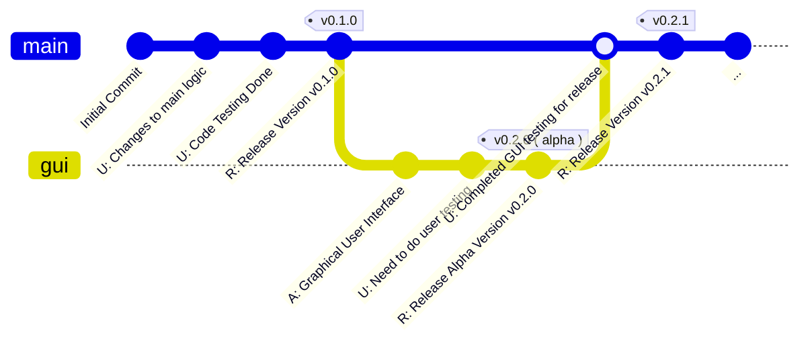

## List of Contents

- [[#Git Tags]]
- [[#Showing You How It Looks Like]]
- [[#Using Git Tags]]
- [[#Pushing Git Tags To Remote Repositories]]
- [[#The Common Workflow]]
- [[#Note From mouse-c-py Project]]

---

# Git Tags

> [!INFO] Resource(s)
> 
> - Git Help: `git help tag`
> - Atlassian: https://www.atlassian.com/git/tutorials/inspecting-a-repository/git-tag
> - GitHub - Release: https://docs.github.com/en/repositories/releasing-projects-on-github/about-releases

A 'tag' is basically that... A "*tag*"!

Tags are a specific **reference point** in a Git history and they are used to make Releases.

Tags a **not** [[Git - Branches]]. This means that they **don't** move with the history *dynamically*.

## Showing You How It Looks Like

Take a look at the following diagram below and you should be able to understand it as you already understand `branch`es.



As you can see, the **tags** stays at the *same* [[Git - Local Repositories#Git - Commit | commit]] every single time.

> It does not move at all with the history!

## Using Git Tags

> [!NOTE]
>  Obviously, I do think you should take a look at the official manual page for `tag` in `git` using `git help tag`!
>  
>  Also, I am going to create a simple local repository using `git init` to show you how to use it.
>  
>  Nevertheless, I **might** make references to my "*semi-failed*" [mouse-c-py](https://github.com/Sunhaloo/mouse-c-py) project as it was the first time that I learned about Git Tags.

- Create local repository for learning `git tags`:

```bash
# create a simple, local repository
cd ~/Desktop && mkdir tag-learning && cd tag-learning && git init
```

> I am now going to create some commits and maybe branches.

- Created some commits and branches!

```console
073040f U: Updated README.md
2fcaa15 A:  File
86a1dc2 Initial Commit
```

- Create a simple, **lightweight**, `tag` for the `073040f` commit:

```bash
# create an initial lightweight tag
git tag v0.1.0
```

- Check the commit using `git --no-pager log --oneline:

```console
073040f (tag: v0.1.0) U: Updated README.md
2fcaa15 A:  File
86a1dc2 Initial Commit
```

- Check all the create git tags:

```bash
# check all tags that has been created
git tag
```

- Therefore, the output for the above `git tag` command is going to be this:

```console
v0.1.0
```

> I am now going to create some branches and more commits

- This is what I currently have:

```console
2783dc6 (HEAD -> main) U: Test main.py file as implemented test functions
268ced6 U: More fucntions to test
6501125 U: test functions has not been verified and implemented into main.py
ad8f914 A: test file added; please test the functions
073040f (tag: v0.1.0) U: Updated README.md
2fcaa15 A:  File
86a1dc2 Initial Commit
```

- Create an actual "*release tag*":

> [!WARNING]
> Releases are **not** part of Git; its part of GitHub Actions CI/CD stuff which is pretty big in of itself.
> 
> Given my limited knowledge on this and my lack of practical usage with it... I am not going to talk about it here!
> 
> > Just remember that its **not** part of `git`.

```bash
# create an annottated tag with a message
git tag -a v1.0.0 -m "Release v1: First Stable Release"
```

- Therefore, if we run our little `git tag` command, we should see that we have 2 tags!

```console
v0.1.0
v1.0.0
```

- Additionally, if we run the same `git log` command that we ran above:

```console
2783dc6 (HEAD -> main, tag: v1.0.0, test) U: Test main.py file as implemented test functions
268ced6 U: More fucntions to test
6501125 U: test functions has not been verified and implemented into main.py
ad8f914 A: test file added; please test the functions
073040f (tag: v0.1.0) U: Updated README.md
2fcaa15 A:  File
86a1dc2 Initial Commit
```

> [!INFO] Fun Stuff
> > Ohh, I did not know this!
> > 
> Compared to `git log` whereby it shows you the older commits **below** ( *like top is the latest* ).
> 
> From what I can see above, `git tag` are going to show the older tags **above** ( *like top is the oldest* ).

- Tag an **older** commit:

> I am now going to try to tag the old commit `6501125`!

```bash
# tag an older commit
git tag -a test 6501125 -m "Need to test older version to understand"
```

- Therefore, if we check all of our `tag`, we should see `test`:

```console
test
v0.1.0
v1.0.0
```

> [!WARNING]
> > So I lied?!?
> 
> It's actually in ordering it in terms of [lexicographical](https://en.wikipedia.org/wiki/Lexicographic_order) ordering!

- Again if we run a `git log`:

```console
2783dc6 (HEAD -> main, tag: v1.0.0, test) U: Test main.py file as implemented test functions
268ced6 U: More fucntions to test
6501125 (tag: test) U: test functions has not been verified and implemented into main.py
ad8f914 A: test file added; please test the functions
073040f (tag: v0.1.0) U: Updated README.md
2fcaa15 A:  File
86a1dc2 Initial Commit
```

## Pushing Git Tags To Remote Repositories

- To push a single tag to the remote repository; use the following template command:

```bash
# push a single tag to the remote repositor
git push origing <tag>
```

- Push all local, non-existing `tag` onto the remote repository:

```bash
# push every single tag
git push origin --tags
```

### The Common Workflow

Now, in a project, you are not going to be only pushing tags, there are going to be **commits**, **branches** and *also* **tags**.

Therefore, here is a simple workflow that I did use for my 'mouse-c-py' project.

> [!INFO] Steps
> 1. Create the commit
> 2. Create the tag
> 3. Push the commit
> 4. Push the tag

> [!NOTE]
> We use the "*push-all*" tags command when we are going to release multiple version of our program, etc!

---

# Note From mouse-c-py Project

So, for this project, I named my branches `v0.1.0`, `v0.2.0` or `v0.3.0`.

Then when I pushed my first tag; the name of the tag was also ( *like I made it like this* ) `v0.1.0`.

But there are 3 main different thing in Git and we know that they are:

- Commits
- Branches
- Tags

The thing that happen was when I tried pushing, I got errors and therefore, I had to do something like this:

- Push the actual commit by targeting the head:

```bash
# push the actual commit
git push origin refs/heads/v0.1.0
```

- Push the tag for that specific commit:

```bash
# push the tag for that specific commit with same branch name
git push origin refs/tags/v0.1.0
```

> [!TIP]
> Therefore, I don't personally recommend to make the your `tag` *name* as the same as your branches!
> 
> > But you totally can and nothing will break if you use the above *long* format instead of a simple `git push origin v0.1.0`!

---

# Socials

- **GitHub**: https://www.github.com/Sunhaloo
- **Instagram**: https://www.instagram.com/s.sunhaloo
- **YouTube**: https://www.youtube.com/@s.sunhaloo

---

S.Sunhaloo
Thank You!