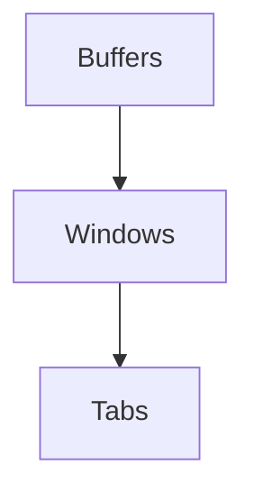

> This is going to be really **gruesome** and extremely **fun** at the same time!

## List of Contents

- [[#Rediscovering Neovim A Tale of Curiosity and Insanity]]
- [[#Neovim Tutor]]
- [[#Lua]]
	- [[#Bubble Sort Algorithm in Lua]]
	- [[#Insertion Sort Algorithm in Lua]]
- [[#Learning to Configure Neovim]]
	- [[#The INIT File]]
	- [[#Create Configuration Directory Structure]]
		- [[#Package Manager]]
			- [[#lazy.nvim]]
				- [[#Installing Plugins | Example: Installing Plugins]]
			- [[#Key Mappings and Options]]
- [[#Miscellaneous Tips]]

---


# Rediscovering Neovim: A Tale of Curiosity and Insanity

## Not Satisfied?

> Really, am I not really satisfied with my **current** Neovim configuration that I have to re-make it for like the $10^{th}$ billion time?

Well, you see, I am extremely happy with my current Neovim setup. Then one of the GOAT of Neovim, [Teej](https://www.youtube.com/@teej_dv), dropped this [video](https://www.youtube.com/watch?v=TQn2hJeHQbM) and I went into a bit of reflection.

> "*Do I understand Neovim?*"

The reason why I don't say "*know*" is because I "*know*" Neovim. It's the greatest editor of all time! Instead of making code-writing boring, it transforms it into a really cool experience similar to playing a game where you can customise pretty much anything.

But do I really *understand* Neovim? Nah... Not a single bit. I have been just copying code and to be honest with you; I am getting to a point where I can carry myself if something does not work as intended. But if you tell me to write some type of auto-command or something similar. You can bet your small ass that I am **completely fucked**! I never, like never, ever did the Neovim Tutor ( `:Tutor` ). That's how bad it is!

Therefore I am going to **restart** my Neovim Journey and completely start from scratch. When I say "*completely*", I mean removing my entire configuration from my system and for things like `keymaps.lua` and `options.lua` I will not even copy and paste these configuration into the *new* one!

In addition, I want to be part of the 'Advent of Neovim' series and like many people are saying. This will be the de facto Neovim Introduction for the later generations!
Like I said I think that this really cool and I would like to also improve my knowledge of the program that made me fell in 'FOSS' and Linux!

Hence, I am going to run the following command to remove any configuration from my system

```bash
rm -rf ~/.config/nvim
rm -rf ~/.local/share/nvim; rm -rf ~/.local/state/nvim
```

> It has started!

# Neovim Tutor

> [!INFO]
> Command to run to enter the Tutorial
>
> ```console
> :Tutor
> ```

> Ohh, its interactive!

So, its simple enough. You read through the steps ( *for the exercise* ) and then you are prompted with some type of sentence or words or a list of sentences. You are then required to use the motions that you are being told to use / learning; so that you can complete the exercise.

One feature that took me by surprise, was the fact that there are changing icons in the number line bar ( *I forgot what its called :)* ). This shows you if you have completed the exercise correctly.

One more thing that is really nice for the user is that you have a summary of all the lessons that is being taught. This show that you **don't** need to learn everything by heart and you can always comeback to it with a quick `:Tutor`!

# Lua

> [!INFO]
> The official website for the **Lua** Programming Language: https://www.lua.org/

The reason why people nowadays are using Neovim instead of Regular / Vanilla Vim is because of Lua. Yes, its the programming language that [Roblox](https://en.wikipedia.org/wiki/Roblox) uses.

To be honest with you. I don't really know much about Lua except that:

- Its used with Roblox to make games
- It is used to configure Neovim
- It has '1' indexing for the list!

Yes, compared to most languages which uses '0' for the **index** of the first *value* in an array or list.
Lua uses '1' instead of '0'. In the world of programming this is called '*One-based Indexing*' compared to our regular '*Zero-based Indexing*'

Apart from that I don't really know Lua or than a simple `print("Hello World")`, your simple `local something = "someone"` and of course the regular `return { ... }`!

> It look like a fun language nonetheless. So let's go ahead and try to make an **bubble sort** and **insertion sort** algorithm in Lua

> [!WARNING]
> I am **not** making a comprehensive learning "*lua*" experience here!
>
> I just want to know the basics of the language like writing functions, calling built-in and / or user-defined functions and some data manipulation.
> This is the reason why I picked the **bubble sort** and **insertion sort** algorithms to learn about the fundamental **syntax** of the language.
>

## Bubble Sort Algorithm in Lua

```lua
-- function to output data in an array
local function display_array(array)
	for value = 1, #array do
		print(array[value])
	end

end


-- function to sort the list with bubble sort
local function bubble_sort(data)
	-- variable to store the length of the array
	local array_length = #data

	-- iterate through the whole array
	for i = 1, array_length do
		-- iterate through the numbers in the list
		for j = 1, array_length - i do
			-- sort in ascending order
			if data[j] > data[j + 1] then
				-- similar to Python tuple unpacking
				data[j], data[j + 1] = data[j + 1], data[j]
			end
		end
	end
	-- return the array to the main program
	return data

end

-- our main function
local function main()
	-- create our unsorted array
	unsorted_array = {5, 4, 3, 2, 1}

	-- output the array before sorting
	print("\nArray BEFORE Sorting: \n")
	-- call the function to display array
	display_array(unsorted_array)

	-- call the function to sort the array
	sorted_array = bubble_sort(unsorted_array)

	-- output the array after sorting
	print("\nArray AFTER Sorting: \n")
	-- call the function to display array
	display_array(sorted_array)
	
end

-- call the main function to the main program
main()
```

Here we learn how to: 

- Declare Variables
- Declare and Call Functions $+$ Pass in Arguments and Return "*something*"
- Used `for`, `if` statements ( *iteration and selection* )

> [!INFO]
> Again, Lua $\neq$ Python... Obviously; but there sure is some similarities like the Tuple Unpacking!
>
> In the second `for` loop, you are going to see `array_length - i` instead of `array_length - i -1`. Because we would have used to *latter* in Python.
> This is again, due to Lua '*One-based Indexing*'. Therefore if you used the same way that we do in Python, you are going to go **out of bounds**!

## Insertion Sort Algorithm in Lua

```lua
-- function to output data in an array
local function display_array(array)
	for i = 1, #array do
		print(array[i])
	end
end


-- function to sort the list with insertion sort
local function insertion_sort(data)
	-- iterate through the array
	for i = 2, #data do
		-- hold the current value at index `i`
		local current_value = data[i]

		-- find the index before `i`
		local j = i - 1

		-- condition to enter `while` loop
		-- sorting in ascending order
		while j > = 1 and data[j] > current_value do
			-- swap the value
			data[j + 1] = data[j]
			-- decrement the index / address `j`
			j = j - 1
		end

		-- place the current value at the correct position
		data[j + 1] = current_value
	end

	-- return the list to the main program
	return data
end


-- our main function
local function main()
	-- create our unsorted array
	unsorted_array = {5, 4, 3, 2, 1}

	-- output the array before sorting
	print("\nArray BEFORE Sorting: \n")
	-- call the function to display array
	display_array(unsorted_array)

	-- call the function to sort the array
	sorted_array = insertion_sort(unsorted_array)

	-- output the array after sorting
	print("\nArray AFTER Sorting: \n")
	-- call the function to display array
	display_array(sorted_array)
	
end

-- call the main function to the main program
main()
```

Here, we learnt that:

- Python Operators like `and` or `or` is the **same** as in Lua
- `while` loops ( *iteration / repetition* )

> [!NOTE]
> To be honest I made a lot of shitty, simple mistakes that could have been fixed if I was confident in my programming skills!
>
> For Example: We all know by now that Lua' indices starts with `1`. Hence, the line `for i in range(1, len(data)):` from Python becomes `for i = 2, #data do`. But fool me knew that but still thought that `i = 1` would work. In addition, we need to do `j > = 1` instead of `j > = 0`.
>
> But to be honest, I would never have coded in Lua if it was not for this Journey!

---

# Learning to Configure Neovim

## The INIT File

> Link to Advent of Neovim video: https://www.youtube.com/watch?v=TQn2hJeHQbM&t=410s

The `init.lua` file is the **main** file for Neovim. Its ( *again* ) the main file that you use to configure Neovim.

There are configuration like [kickstart.nvim](https://github.com/nvim-lua/kickstart.nvim) which is again made by [Teej](https://www.youtube.com/@teej_dv) which are **completely single-filed**!

> I like the "*structured*" way of configuring Neovim with different files and folders.

### Hello World

First of all, we need to make the configuration folder in the directory `~/.config`. Below you are going to find the commands below $\downarrow$:

```bash
# change from the current working directory '.config'
cd ~/.config
# make the 'nvim' folder and move to that directory
mkdir nvim; cd nvim
# create - open the 'init.lua' file with neovim
nvim init.lua
```

#### `init.lua`

Well, to show you what the `init.lua` is and how its considered / is the **main** file for Neovim, go ahead and type the following code below $\downarrow$ in the file:

```lua
print("\nHello World\n")
print("This is the `init.lua` File")
```

> BTW to paste from the **system's clipboard** to your `init.lua` *buffer*. You can do `"+p`; where they are separate characters!

Now **save** the file with `:wq` which stands for "*write and quit*".
Go ahead and open up Neovim again and you are going to see that these lines of code will be **automatically** executed. This in a way gives you the idea of how Neovim considers this as the *main* configuration file.

> [!WARNING]
> Remember one thing; I am not going to give you a comprehensive guide on how to use (Neo)vim.
> There are plenty of guides and YouTube video about this subject. In addition, I am not even that good to show cools things that you can do!

> [!BUG]
> Note that the `init.lua` file and the `require("config.filename)` is a bit like the `import` or `from` keyword in Python.
> Where the *first* one will have **top most** priority and then the second and so on.
>
> Therefore after writing your `lazy.lua`, `options.lua`, `keymaps.lua` file... You need to call the `keymaps.lua` file **first** then `options.lua` and then `lazy.lua` ( *at least that's how I do it* ). Hence, all **our** options and keymappings will be loaded first then the plugin configuration that we are importing / "requiring" with 'lazy' will then be sourced!

---

Simple Exercise: Write a Function to Display "*Hello World*" 5 times

```lua
-- function to display "Hello World" 5 times
local function greet()
	for i = 0, 4 do
		print("Hello World")
	end
	print("\n")
end

-- call the function to the main program
greet()
```

When you are going to close and re-open Neovim again; you are going see something like this $\downarrow$:

```console
Hello World
Hello World
Hello World
Hello World
Hello World

```

---

### Create Configuration Directory Structure

Go ahead and create the following folder under the directory of `~/.config/nvim`

```console
 .
├──  init.lua
└──  lua
    ├──  config
    └──  plugins
```

So now, we are going to install things to start making our [Personal Development Environment](https://medium.com/@alpha2phi).

> We are going to start with the *package manager*!

---

## Package Manager

> Link to Advent of Neovim Video: https://www.youtube.com/watch?v=_kPg0VBRxJc

There are several package managers that are available for Neovim. There are:

- [vim-plug](https://github.com/junegunn/vim-plug)
- [packer.nvim](https://github.com/wbthomason/packer.nvim)
- [lazy.nvim](https://github.com/folke/lazy.nvim)

In the modern Neovim world, most of us are using 'lazy.nvim' by one of the Neovim greats [folke](https://github.com/folke). Because its that good!

> "*[Mah Boi Folke](https://www.youtube.com/watch?v=ZWWxwwUsPNw&t=487s)*"

### lazy.nvim

As I said we are going to be using 'lazy.nvim' because:

1. It is currently the standard
2. This is the only package manager that I have used for Neovim.

In the video; Teej recommends to go to the [official website](https://lazy.folke.io/installation) to install the package manager. But here $\rightarrow$ [GitHub](https://github.com/folke/lazy.nvim) page for 'lazy.nvim' if you want to read more about it or take a look at the code!

#### Installation

##### Runtime Paths

There are places where Neovim will source our `.lua` files. These places are called the "*runtime paths*". This is due to the fact that they "*start*" when you open Neovim.

You can check these runtime paths by running the command below $\downarrow$ in Neovim:

```bash
echo nvim_list_runtime_paths()
```

When I run the above $\uparrow$; I get the following output:

```console
['/home/user/.config/nvim', '/etc/xdg/nvim', '/usr/share/nvim/runtime', '/usr/share/nvim/runtime/pack/dist/opt/
matchit', '/usr/lib/nvim', '/usr/share/vim/vimfiles'] 
```

As you can see, we have our configuration structure / directory `/home/user/.config/nvim` here!

Thus, our files will be loaded if we it in the runtime path which we are doing!

> Back to the installation process!

Go to the website and copy the structured setup and head over to `~/.config/nvim/lua/config/`. Create and open a new file called `lazy.lua` and paste the contents over there.

We are going to modify some things so that our `lazy.lua` file will look like this:

```lua
-- install and start lazy
local lazypath = vim.fn.stdpath("data") .. "/lazy/lazy.nvim"
if not (vim.uv or vim.loop).fs_stat(lazypath) then
  local lazyrepo = "https://github.com/folke/lazy.nvim.git"
  local out = vim.fn.system({ "git", "clone", "--filter=blob:none", "--branch=stable", lazyrepo, lazypath })
  if vim.v.shell_error ~= 0 then
    vim.api.nvim_echo({
      { "Failed to clone lazy.nvim:\n", "ErrorMsg" },
      { out, "WarningMsg" },
      { "\nPress any key to exit..." },
    }, true, {})
    vim.fn.getchar()
    os.exit(1)
  end
end
-- add the variable `lazypath` to our `rtp` ==> runtime path
vim.opt.rtp:prepend(lazypath)

-- set our global and local leader key
vim.g.mapleader = " "
vim.g.maplocalleader = " "

-- setup lazy.nvim
require("lazy").setup({
  spec = {},
  -- automatically check for updates
  checker = { enabled = true },
})
```

##### Explanation of the Code

###### Variable `lazypath`

As you can see we have this variable `lazypath` that is being concatenated with `"/lazy/lazy.nvim"`. But that is `vim.fn.stdpath("data")`?

If you go ahead and you run the command inside of Neovim:

```bash
echo stdpath("data")
```

In my case, it returns the path: `/home/user/.local/share/nvim`... Do we know this place...?
Yes, yes we do know this path ( *I can say place* ); remember at the beginning of this journey I removed my Neovim configuration with some commands?

If you don't remember here it is:

```bash
rm -rf ~/.config/nvim
rm -rf ~/.local/share/nvim; rm -rf ~/.local/state/nvim
```

The `stdpath("data")` just shows the place where we have all of our Neovim data.

In simple English, when you are going to install a plugin via 'lazy'. Its going to **clone** that *plugin* repository in `stdpath("data")` ( *it will definitely make additional folders... Obviously*! )

Hence, the lines of code:

```lua
-- create a variable for the data path
local lazypath = vim.fn.stdpath("data") .. "/lazy/lazy.nvim"
-- *try* to install lazy.nvim if folders / files has not been found at `lazypath`
if not (vim.uv or vim.loop).fs_stat(lazypath) then
  -- create variable for lazy's repsository
  local lazyrepo = "https://github.com/folke/lazy.nvim.git"
  -- clone the repository into our system
  local out = vim.fn.system({ "git", "clone", "--filter=blob:none", "--branch=stable", lazyrepo, lazypath })
  -- if any error occurred output appropriate messsage and abort everything
  if vim.v.shell_error ~= 0 then
    vim.api.nvim_echo({
      { "Failed to clone lazy.nvim:\n", "ErrorMsg" },
      { out, "WarningMsg" },
      { "\nPress any key to exit..." },
    }, true, {})
    vim.fn.getchar()
    -- exit the program with error
    os.exit(1)
  end
end
```

> By commenting the code, you should be able to understand what is happening.
> BTW this is the first time I ( *tried* ) understanding a "neovim's" code instead of blatantly copying it. *The Truth is the Truth*!

But I want to explain one thing. Remember by shitty YouTube Video Downloader and / or Audio Converter, [PyYu](https://github.com/Sunhaloo/PyYu)?

There I used the `subprocess.run` module so that I can run *shell* commands from Python!
This line of code $\downarrow$ is basically the **same** thing but sprinkling some neovim's syntactic sugar!

> BTW its not literally "*syntactic sugar*", its done using "*vim's*" API.

```lua
-- clone the repository into our system
local out = vim.fn.system({ "git", "clone", "--filter=blob:none", "--branch=stable", lazyrepo, lazypath })
```

##### The Final Step!

Close the `lazy.lua` file and head over to our `init.lua` file and write:

```lua
require("config.lazy")
```

> [!SUCCESS]
> Save and quit and **re-open** Neovim to watch the magic happen!
> Well nothing happen! Neovim seems to have crashed and the Neovim buffer reappeared. Well you see, this means that it was *cloning* in the 'lazy.nvim' repository. Now, go ahead and run the command `:Lazy`. A floating window should appear!
>
> > "*Success*!"
>
> In addition re-write the Neovim command `echo nvim_list_runtime_paths()` again and you are going see that now have more paths.

> BTW, we have not installed any plugins yet!
> I will show you when its the time to install one! In addition, we are going to have to update the `lazy.lua` file so that 'lazy.nvim' can see where our plugins are located.

---

> [!WARNING]
> For the moment I will not focus on plugins that are for appearance or even quality of life.
> This is because I want to try and learn about the Language Server Protocol ( *LSP* ) and other *LSP* related things.
>
> Like this was the main reason that I am re-doing all of this. To learn about these stuff so that I can configure them to my liking!

---

### Key Mappings and Options

> Link to Advent of Neovim YouTube video: https://www.youtube.com/watch?v=F1CQVXA5gf0

Like I have said in the beginning, I will **not** copy and paste my `keymaps.lua` file and `options.lua` file.
This is because I want to *try* something different!

In the video, Teej showed use `after/ftplugin` directory. The folder `ftplugin` means "*filetype plugin*" where we can **specific** options / configuration for a **specific** *language*!

In addition, we call if the `after` folder / directory because we want Neovim to *source* these files **after** all of our *default* configuration files have been loaded in!

> As he said in the Video... Neovim and Lua have a way to automatically do that "*after*" thing for us!

Meaning that, in Python `.py` files, we don't have *relative line numbers* and only *line numbers* while in C `.c` files, we have **both**!

> This is actually really cool and seems extremely useful.

Hence, this is what I want to try; as you know, I do some **markdown** in Neovim for things like 'README.md' and other things.
In addition, I want to make Neovim replace Obsidian by using the [obsidian.nvim](https://github.com/epwalsh/obsidian.nvim). Basically, I want to *try* this `ftplugin` thing!

Well, lets' go started, lets make the directory!

```bash
# again, make sure that you are on the right working directory
cd ~/.config/nvim
# make the directory
mkdir -p after/ftplugin
```

#### Testing Directory Setup

Go ahead and create a `lua.lua` file in that directory and place the following code below $\downarrow$:

```vim
vim.opt_local.number = true
```

Now, go ahead and just open another file like `main.py`. Well, you **should not** see and numbers in the column!
While if you close that shitty `main.py` file and open our beautiful `lua.lua` file ( *or any `.lua` file for that matter* ); you are going to see beautiful line numbers...

> [!NOTE] Note to Myself!
> See how we are not using `vim.opt` and instead we are using `vim.opt_local`.
> In addition, we **always** can read `help vim.opt_local`
>
> > *If you do give it a read; there are also for `vim.opt_global` and `vim.opt`*

> [!TIP]
> To get the file type of your file if you don't know what file *extensions* are or you are on [Windows](https://www.youtube.com/watch?v=q9mXyakv2i8) ( *because Windows will hide the file extension by default* ). You can run this $\downarrow$ command in the current Neovim Buffer ( *like when you open your file* ):
>
> ```vim
> set filetype?
> ```
>
> One more tip! If you need to make a keymap but you don't know if it has already been taken up. You can use the following below $\downarrow$:
>
> > Use `:map` followed by the "*required*" keymap
>
> ```console
> :map keymap_here
> ```
>
> This is going to output something that looks something like this when trying to find if `<Ctrl> + a` has any keymappings.
>
> ```console
> n  C-A       * ggVG
> 				Select All 
> ```
>
> > "*Yes it has this weird indentation...*"
> > In addition, its `<C-a> ` and not `C-a`... Because of Obsidian!
>

> [!INFO]
> I will not be including any `keymaps.lua` or `options.lua` file ( *block code* ) here. Because this markdown file will become too big ( *that's what she said* ) and will take a lot of time to load in Obsidian.
>
> > I swear its not my PC! React based fucking app!
>
> Instead I will be linking my main [dotfiles](https://github.com/Sunhaloo/dotfiles) repository where I do have my Neovim setup there!
>
> Link to Neovim Directory at GitHub: 

> [!BUG] Add Repository Link in the above $\uparrow$ Callout!!!

---

### Installing Plugins

#### Configure Lazy

Remember our directory structure looks like this $\downarrow$:

```console
 .
├──  init.lua
└──  lua
    ├──  config
    └──  plugins
```

As you can see and quickly guess... We are going to be installing our plugins in the `plugins` folder.

But right now, 'lazy' does **not** know where our folder `plugins` is currently situated. Hence, we need to configure our `config/lazy.lua` file again.

To point the `plugins` directory, configure the code like this:

```lua
-- setup lazy.nvim
require("lazy").setup({
  spec = {
      { import = "plugins" }
  },
-- other configuration below
```

Now, if you want to use other directories inside the `plugins` folder. You can do something like this

```lua
-- setup lazy.nvim
require("lazy").setup({
  spec = {
      { import = "plugins" },
      { import = "plugins.LSP" }
      { import = "plugins.coding" }
  },
-- other configuration below
```

Whereby here, we can see that there are 2 other folders in the `plugins` directory; `LSP` and `coding`.

> I don't think that I will be using this way now.
> In my old configuration, I **did** make another folder for `LSP` and `markdown` related things.
> But, I think I will keep it simple and just make it file based. For example `plugins/markdown.lua` will contain all the markdown plugins that I use.

#### Installing Plugins

Let's say that you want to install the plugin '*x*', '*y*' and last but not least, '*z*'.

##### Installing 1 Plugin

Here we are going to create a file called `x_plugin.lua` whereby we are going to be installing the plugin '*x*'.

```lua
-- basically return a table like this
return {
	"author/x.nvim",
	events = { "InsertEnter" },
	dependencies = {
		"joe/mama.nvim"
	}
	-- configuration for 'x'
	config = function()
		-- do your configuration here.
	end,
}
```

As you can see, its pretty simple. But what if you want to install 2 related plugins like '*y*' and '*z*' together in a single file so that you can have a proper structure?

> Think about it...

##### Installing 2 Plugins ( Same File )

> I see you did not think about it

Well, in this case, we are going to return, return a table. Yes "*return return a table*".

It's basically the same but different... But still same.

```lua
return {
	-- install plugin 'y'
	{
		"author/y-your",
		events = { "BufReadPre", "BufNewFile" },
		dependencies = {
			"joe/mama.nvim"
		}
		-- configuration for 'x'
		config = function()
			-- do your configuration here.
		end,
	},
	-- install plugin 'z'
	{
		"author/z-mama",
		-- configuration for 'x'
		config = function()
			-- do your configuration here.
		end,
	{

	}
}
```

> [!SUCCESS]
> I think what you now know how to install plugins!

---

Now, I am going to install and configure "*things*" in Neovim.
I will be making "*atomic*" files that will hold the plugins and configurations that I will be doing.

> As always there is https://github.com/Sunhaloo/dotfiles/tree/main/nvim

---

# Miscellaneous Tips

## Buffers, Windows and Tabs

> Link to YouTube Video: https://www.youtube.com/watch?v=htUMvXINZCA



So:

- **Buffer** are the *text object* itself
- **Windows** hold the *buffers* ( *things like splits in a single window* )
- **Tabs** hold multiple *windows*

> To learn more about these $\uparrow$, simply run `:h window` in Neovim

# Socials

- **Instagram**: https://www.instagram.com/s.sunhaloo
- **YouTube**: https://www.youtube.com/@s.sunhaloo
- **GitHub**: https://www.github.com/Sunhaloo

---

S.Sunhaloo
Thank You!
