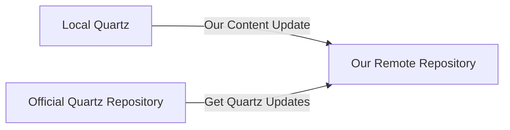

## List of Contents

- [[#Installation and Setup]]
	- [[#Cloning Original Quartz Repository]]
	- [[#Writing Your Content]]
		- [[#Content Folder]]
		- [[#Build Quartz To Preview]]
		- [[#Keep Writing!]]
- [[#Git and Hosting]]
	- [[#Setup Syncing With Git]]
	- [[#Host Using GitHub Pages]]
- [[#Another Machine?]]

---

> [!INFO] Resource(s)
> - Quartz Documentation: https://quartz.jzhao.xyz/
> 	- Hosting Using GitHub Pages: https://quartz.jzhao.xyz/hosting#github-pages
> - Preact: https://preactjs.com/

> [!NOTE]
> This note / file was created to support the official document!
> 
> The reason as to why I made this is because I am always so confuse when we get to the later parts of like setting up the GitHub repository and hosting through GitHub.
> 
> > IDK, I know how Git and GitHub works but I still mess it up!

# Installation and Setup

## Cloning Original Quartz Repository

Following the official documentation, it tells us to clone the actual [quartz](https://github.com/jackyzha0/quartz) repository and then basically setup everything from there!

```bash
# clone the 'quartz' git repository and head inside it
git clone https://github.com/jackyzha0/quartz.git && cd quartz

# install all the required note dependencies
npm i

# run the command to very first time setup!!!
# NOTE: running this command give you and interactive prompt
# for the Obsidian link setting; simply leave it to `default`
npx quartz create
```

> [!INFO]
> Quartz is based on Preact which is simply a **lightweight** version of React!
> 
> That is why the commands like `npm i` and others feel kind-of similar its because its literally a stripped down version of React!

## Writing Your Content

Now that you have cloned the repository; you should see that you have a `quartz` directory and therefore inside that quartz directory; you should see something like this:

```console
 quartz
├──  CODE_OF_CONDUCT.md
├──  content
├──  Dockerfile
├──  docs
├──  globals.d.ts
├──  index.d.ts
├──  LICENSE.txt
├──  package-lock.json
├──  package.json
├──  quartz
├──  quartz.config.ts
├──  quartz.layout.ts
├── 󰂺 README.md
└──  tsconfig.json
```

Therefore, what we are currently interested right now is the `content` folder whereby its the *place* that all of our "*notes*" / **markdown** files are going to be stored.

### Content Folder

Head inside the content folder and you should see that we have a lonely `index.md` file!

```console
 .
└──  index.md
```

Think of that `index.md` file as our **root**... This markdown file is going to be our **homepage** and when someone is going to go on the website. It should redirect to that page.

> Hence, let's go ahead and write something inside of it!

- I updated my `index.md` file to this:

```md
---
title: Quartz Homepage
---

# Obsidian Notes

This is the homepage for our Obsidian _markdown_ notes!

> [!SUCCESS]
> This is actually very nice and we have nothing to lose as its **free**!
```

### Build Quartz To Preview

Well, the main thing about this quartz thing is to be able to render our markdown files on the internet right?

> So how do we actually do that?

Well, simply run the following command below to be able to preview your "*website*":

```bash
# preview the website on localhost / your machine
npx quartz build --serve
```

> [!NOTE]
> If you are not a developer or not in the realm of computers. Let me explain the above command in simple terms.
> 
> The above command is going to **fetch** all the *contents* that is found in the actual `content` folder.
> 
> Then, when it see these folders and markdown files; its going to **convert** them into their respective `.html` files.
> 
> > The thing about markdown is that is really similar to [HTML](https://en.wikipedia.org/wiki/HTML)!
> 
> Now, each time you add **new** notes; this means that its going to have to *convert* these new notes into their respective `.html` files ( *for the first time* ).
> 
> This means that it might take a while depending on the number of markdown files that you add!
> 
> > [!WARNING]
> > Additionally, if you are previewing using the above command; you need to let the command **run** else, the ( *local* ) website is just going to "*die*".
> > 
> > Then, when you are finished... You can simply close your terminal like a peasant or press `Ctrl + C` to close the *server*.

> [!SUCCESS]
> Therefore, if you head over to [http://localhost:8080](http://localhost:8080); you should see that the quartz website whereby you are redirected to the `index.md` homepage!

> [!TIP]
> If you head over to the `quartz/public` folder; you should see that the **equivalent** `index.html` files is found there!

### Keep Writing!

> [!INFO]
> Go ahead and take your time to write all the notes or even copy some notes from your **private** obsidian folder / vault.
> 
> Simply add everything that you want people to see and then you can continue this!

> [!BUG]
> We all know the reason that you are making this right?
> 
> > To be bit of a show-off and flex your notes while still being helpful to others!
> 
> Well, there is something that **breaks** the beautiful Obsidian Graph that quartz give us!
> 
> > **Images**!
> 
> Yes, if you are like me and already have a **private** Obsidian vault with *many* notes... Then, if your notes **does** have *images*; the Obsidian graph on the website will kind-of break!
> 
> > [!TIP] Fixing It!
> > 
> > Given that I have a `Media` folder at the root of my Obsidian vault whereby inside that `Media` folder is looks something like this:
> > 
> > ```console
> >  Media
> > ├──  Images
> > ├──  Templates
> > └──  Videos
> > ```
> > 
> > Simply add all your images inside the `content` folder!
> > 
> > Therefore for me, is going to be placing the `Media` folder inside the `quartz/content` folder!

> [!SUCCESS]
> After you have added everything that you need to, including your *images*.
> 
> You can run the `npx` command again ( *if you have closed it* ) or simply wait for it to "*hot-reload*" or "*live-reload*" ( *or whatever...* ).
> 
> Therefore, you should see that your **changes** will be updated and therefore you will be able to see your newly added *content*!

# Git and Hosting

## Setup Syncing With Git

Well, the obvious and most logical step is to be able to ~~backup~~ *track* our notes using things like [[Git - Introduction | Git]] and [[Git - Remote Repositories | GitHub]].

> Yes, ~~backing up~~ "*tracking*" notes are very important!

Therefore, head over to [github.com](https://github.com/) and make yourself and account and create a new GitHub repository.

> [!IMPORTANT]
> You **need** to make sure that you **don't** setup / initialise the repository with:
> 
> - `README.md` file
> - `.gitignore` file
> - License
> 
> Yes, should **not** have any of the above and basically make an empty remote repository!
> 
> > You can choose if you want to have the repository *private* or *public*!

After, creating the empty repository; you are going to have to save your `REMOTE-URL` which is basically the URL that you use to actually `clone` the remote repository!

This `REMOTE-URL` looks something along the lines of:

```console
# if you are using HTTPS ( on Windows or whatever )
https://github.com/username/obsidian-quartz.git

# if you are using SSH ( this is way better )
git@github.com:username/obsidian-public-vault.git
```

> Basically it should look something like in the above code block!

### Sync With Local Quartz Repository

Our newly created repository is **empty** and in this case, we are going to link the *local* `quartz` repository to our remote repository while also keeping our remote repository *connected* with the official quartz repository.



- Therefore go ahead and head over to your **local** `quartz` directory and run the following commands:

> Yes, these commands below should be run at the root of the `quartz` directory

```bash
# list the current remote that repository is pointing
git remote -v

# link up our remote repository with their repository
git remote set-url origin REMOTE-URL

# finally link up to original quartz directory so as to get updates 
# NOTE: if you get an error saying its already added
# this means that you don't have to do a thing!
git remote add upstream https://github.com/jackyzha0/quartz.git
```

- Therefore, if we check again, we should have something along the lines of:

```console
origin	git@github.com:Sunhaloo/obsidian-quartz.git (fetch)
origin	git@github.com:Sunhaloo/obsidian-quartz.git (push)
upstream	https://github.com/jackyzha0/quartz.git (fetch)
upstream	https://github.com/jackyzha0/quartz.git (push)
```

> In my case, I decided to name the public Obsidian repository `obsidian-quartz`.

- Run the following command to actually **synchronise** the *three* repositories with each other:

```bash
# synchronise everything for the first time
# first time running this command ==> `--no-pull`
npx quartz sync --no-pull
```

> [!SUCCESS]
> As you can see we have been able to add **sync** up everything and if you go back to the GitHub repository on your browser.
> 
> After a quick *refresh*; you should see that you do have all the contents of the local `quartz` repository inside our newly created remote repository!

> [!WARNING] Read this and we'll come back to it later!
> 
> As you can see, it means that current workflow is to:
> 
> 1. Write / Add the content inside of the `quartz/content` directory
> 2. Run the `npx quartz sync` command
> 3. Enjoy
> 
> But what if we **don't** have that `quartz` directory locally ( *i.e what if we lose it...* )? We are going to later learn how to do everything from the **remote** repository that *we* created!

## Host Using GitHub Pages

> Now, here comes the fun part!

- Go ahead and create a `deploy.yml` file at this location `quartz/.github/workflows`:

> The code block below shows the content of the `deploy.yml` file...

```yaml
name: Deploy Quartz site to GitHub Pages
 
on:
  push:
    branches:
      - v4
 
permissions:
  contents: read
  pages: write
  id-token: write
 
concurrency:
  group: "pages"
  cancel-in-progress: false
 
jobs:
  build:
    runs-on: ubuntu-22.04
    steps:
      - uses: actions/checkout@v4
        with:
          fetch-depth: 0 # Fetch all history for git info
      - uses: actions/setup-node@v4
        with:
          node-version: 22
      - name: Install Dependencies
        run: npm ci
      - name: Build Quartz
        run: npx quartz build
      - name: Upload artifact
        uses: actions/upload-pages-artifact@v3
        with:
          path: public
 
  deploy:
    needs: build
    environment:
      name: github-pages
      url: ${{ steps.deployment.outputs.page_url }}
    runs-on: ubuntu-latest
    steps:
      - name: Deploy to GitHub Pages
        id: deployment
        uses: actions/deploy-pages@v4
```

- Go into your **remote** repository:
	- Go to the 'Settings' tab
	- There, you should see something like 'Pages'
	- Under 'Pages'; try to find the 'Source' and select 'GitHub Actions'
	
- Finally head over to our local `quartz` repository and run the `sync` command:

```bash
# sync everything up again
npx quartz sync
```

> [!SUCCESS]
> This means that after it *builds* and *deploys*; you should see that you have your *website* / notes hosted over at: `<github-username>.github.io/<repository-name>`

# Another Machine?

Given that I mentioned the current workflow above... Now, what if you are one another machine or your current machine *crashes*?

This means that we have *lost* the **local** `quartz` repository... Therefore what should we do?

> Well, its actually simpler than I thought it would be!

> [!TIP] The Steps!
> 
> 1. Clone your **remote** repository on your machine using `git`
> 2. Add, Update and Write your contents inside the `your-remote-repository/content` folder
> 3. Run the `npx quartz sync` command
> 4. Wait GitHub Pages to finish building
> 5. Finally, enjoy your content for free hosted online!

> [!INFO]
> I suggest you to also do the **same** thing if you are still using the *local* `quartz` repository.
> 
> This means that you are going to have *central* place where you do **everything** and given that its on GitHub... You probably **won't** lose it.
> 
> > [!TIP]
> > These commands like `npx quartz sync` is basically *running* `git push` under the hood.
> > 
> > But its better to use "*his*" `quartz` commands as they might be also doing **different** thing under the scene.

---

# Socials

- **GitHub**: https://www.github.com/Sunhaloo
- **Instagram**: https://www.instagram.com/s.sunhaloo
- **YouTube**: https://www.youtube.com/@s.sunhaloo

---

S.Sunhaloo
Thank You!
