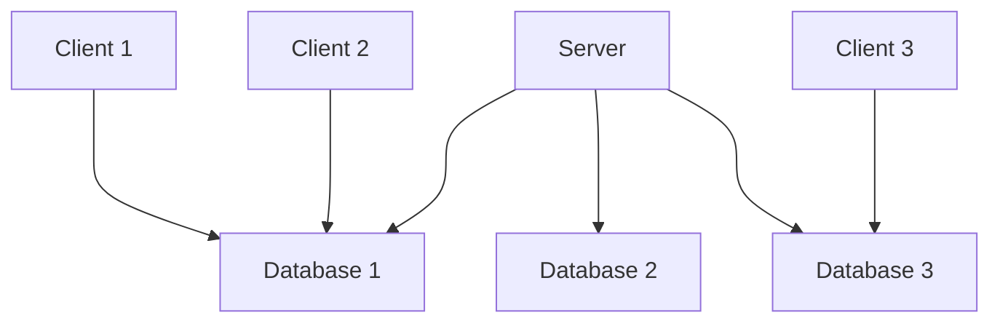

## List of Contents

### General Points

- [[#Requirements]]
- [[#Server v/s Database]]

### SQL Server Management Studio Usage

- [[#Getting Started| Getting Started]]
	- [[#Opening Management Studio]]
	- [[#The Object Explorer]]
	- [[#New Query]]
	- [[#Final Setup]]
	- [[#Disconnecting from Server]]
- [[#Miscellaneous and Problems]]
	- [[#Changing to Dark Theme]]
	- [[#Deleting Database with `DROP`]]

---

# Requirements

## SQL Server 2022 Express Edition Installation

This is the actual "*server*" that will allow us to connect to **local** or **remote** servers.

The download link is: https://www.microsoft.com/en-us/sql-server/sql-server-downloads


## SQL Server Management Studio Installation

Think of this program like an editor and management for the "*server*".
It's the place where the user will be able to; for example run commands and queries ( *and more*! ), which will be *re-directed* to the SQL Server $\uparrow$

Here is the download link for Management Studio: https://learn.microsoft.com/en-us/sql/ssms/download-sql-server-management-studio-ssms?view=sql-server-ver16

> [!WARNING] Short Notice for my Linux Fans
> The SQL Server is available on Linux that to only on Ubuntu
> But the Management Studio is <span style="color: red;"> not</span> available.
> Hence, if you want to use a GUI application / program for running command and more; you can use [Visual Studio Code](https://code.visualstudio.com/) with the proper extensions.
> > I tried installing on Pop OS ( *which is based on Ubuntu which is based on Debian* ); but it crashed my **update** and I could not update... Hence, I switched to Endeavour OS...
> > I use Arch BTW!

---

> Start of the actual notes / documentation

# Server v/s Database

Study this image below $\downarrow$

![[Server vs Database.png | 800]]

Let's break this image down!

> This is going to be so much easier if you already understand the '*Client-Server Model*'.

So you have a **Client**. This *client* is the **user**; the user can access the **Server** from the *desktop*, `ssh`, etc.

Now when the user is going to access this so called "*server*". He is not accessing the **Databases** ( *or Tables if you prefer* ) directly.

In this *server*, you will find that we have many **databases** and hence, the client connects to that server and then selects what databases he wants to work with.

> Like in the image! $\uparrow$



> I hope this mermaid graph helps you to visualise it better!

# Getting Started

> [!WARNING]
> As I said I am currently running Endeavour OS and as it is Arch based distribution... No, I can install it on Arch using the AUR / `yay` as you can see $\downarrow$:
> ```console
> aur/go-sqlcmd 1.7.0-1 (+1 0.00) 
>    CLI for SQL Server and Azure SQL
> ```
> But for simplicity sake and as I am do not want to brick my update and other shitty stuff happening to my system. I am going to simply use SQL Server 2022 and SQL Server Management Studio on Windows.
> > Also they are using Windows to show SQL Server in University. Sooooo...

## Opening Management Studio

Every time that you start up the program; you will be greeted with this $\downarrow$

![[SQL Server 2022 - Connect to Server Screen.png]]

This is the place where you are going to **connect** to the server that you want

> [!NOTE]
> For the moment, we are only going to be using the `localhost` to learn the commands of [[Database Languages#Structured Query Language ( SQL ) | SQL]]
> Hence, if we are going to continue using the `localhost` "*server*"; we need to make a few adjustments!

As you can see from the picture above $\uparrow$. In the **Login** tab; leave **every** option alone.
But for the *Encryption* set it to `Optional` ( *again as shown in the image $\uparrow$* )

After you are done then you can press the <button> Connect</button> button.

> [!INFO]
> Why did we leave options like *Server type*, *Server name* and the other options *alone*?
> This is because we **want** to connect to `localhost`; the server name that was provided is your <u> machine's name</u> .
> > If you check out the '*User name*' option ( *which we cannot tamper with* ); you can see that my username is `username`!

## The Object Explorer

When you have successfully connected to `localhost`, you should see the "*Object Explorer*" in the left part of the screen.

> It should look something like this $\downarrow$

![[SQL Server 2022 - Object Explorer.png]]

> I have cut out the screenshot because its to big
> "*That's what she said*"

This is where you are going to see your databases, tables and more!

Here is another image to show you what it looks like after **expanding** some *folders* and *databases* $\downarrow$

![[SQL Server 2022 - Object Explorer ( Expanded ).png]]

> [!WARNING]
> If you accidentally close the Object Explorer, no worries mate!
> You can quickly bring it up by pressing the `<F8> ` key.

## New Query

So there is a button called <button> New Query</button> . Now this button the button that will bring up the Editor ( *if you can called it that* )

![[SQL Server 2022 - New Query Button.png]]

> [!NOTE]
> The shortcut for a *New Query* is `<Ctrl> + N`

## Final Setup

As I said it should bring up the "*Editor*" ( *I called it the Editor... Fuck Off* )

Your setup should now look something like this $\downarrow$:

![[SQL Server 2022 - Final Setup.png | 785]]

> [!NOTE]
> When I did this on my laptop; the Object Explorer was on the side.
> I don't know why here on my Desktop its not the case.
> But then again you can open in up using the `<F8> ` key.

## Disconnecting from Server

![[SQL Server 2022 - Object Explorer ( Disconnect from Server ).png]]

> Or you can also click on '**File**' and then select '**Disconnect Object Explorer**'

## Saving CSV Files

If you save the results of a query; you will see that we do **not** have the *header* included into the `.csv` file.

Hence we need to do some changes in SQL Management Studio so we can get the header when we save a `.csv` file.

> [!TIP] Saving with Headers
> You are **not** going to get the **headers** when you are going to save the file as a `.csv` file.
> Hence you will need to go to the tool bar and go into these options as show below $\downarrow$:
>
> ```console
> |-- Tools
> 	|-- Options
> 		|-- Query Results
> 			|-- SQL Server
> 				|__ Result to Grid
> ```
>
> When you arrive at this screen you should configure it like so:
> ![[SQL Server 2022 - Output CSV File with Headers.png | 750]]

---

# Miscellaneous and Problems

## Changing to Dark Theme

Fuck you Microsoft for not adding Dark mode by default in the settings

Head over to:

```console
C:\Program Files (x86)\Microsoft SQL Server Management Studio 20\Common7\IDE\ssms.pkgundef
```

Open this file with any text editor you have:

- Vim ( *I use VIM BTW* )
- VS Code
- Notepad

Search for '*Remove Dark Mode*' and add `//` ( *comment* ) the line just below it.

> I am writing this not for me... I know how to comment and un-comment weird files.
> But I wrote this because of other people... You, the reader... *Partly also because I will forget the path*.

## Deleting Database with `DROP`

Because of the "*shittiness*" of Microsoft... Sometimes it **won't** let you `DROP` *any* database. Hence, there are 2 solution:

1. Either use the **fucking mouse** to *right-click* ( *on the database* ) and **delete** that specific database
2. Actually make the `DROP` command work

### Making the `DROP` Command Work

If you are like me and is extremely, stubborn and still want to use the `DROP` command... You have to:

- *Right-click* on the database and select '**Properties**'
- Select '**Options**' and *scroll down* until you cannot
- In the section '*State*', look for `Restrict Access | MULTI_USER`
- Change `MULTI_USER` to `SINGLE_USER`

> [!SUCCESS]
> Therefore, you should be able to simply use the `DROP db_name;` command without any issues!

## Created Users Cannot Login

> [!INFO]
> Instead of me explaining you how do this... Simply click on the link below and read the **first** answer!
>
> > Link: https://stackoverflow.com/questions/64325788/cant-login-in-sql-server-management-studio

---

# Socials

- **Instagram**: https://www.instagram.com/s.sunhaloo
- **YouTube**: https://www.youtube.com/@s.sunhaloo
- **GitHub**: https://www.github.com/Sunhaloo

---

S.Sunhaloo
Thank You!
