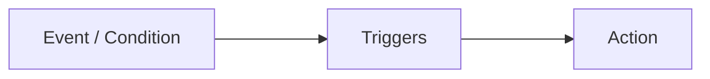

## List of Contents

- [[#What is a Trigger?]]
	- [[#Visual Representation of Triggers]]
- [[#Why Use Triggers?]]
	- [[#Example of Why Use Triggers]]
- [[#Types of Triggers]]
	- [[#AFTER Trigger]]
	- [[#INSTEAD OF Trigger]]
- [[#Trigger Usage in SQL Server]]
	- [[#Example Number of Lecturers]]
	- [[#Turning On / Off Triggers | Enabling / Disabling Triggers]]

---

> [!RESOURCES]
> - https://learn.microsoft.com/en-us/sql/relational-databases/triggers/dml-triggers?view=sql-server-ver16
> - https://en.wikipedia.org/wiki/Database_trigger

# What is a Trigger?

As the Wikipedia states, A Database **Trigger** is [[SQL Procedural Programming - Introduction | procedural] code that it **automatically** executed in response to *certain* **events**.

In short, its like any other Stored Procedures that will be *executed* automatically; meaning that the user does **not** need to run the command `EXEC`.

These *triggers* are normally executed when a user tries to **modify** data through `DML` such as:

1. `INSERT`
2. `DELETE`
3. `UPDATE`

### Visual Representation of Triggers



> [!INFO] Gun Example
> 1. Event / Condition: A-10 See Tank
> 2. Trigger: Pilot Presses the Trigger
> 3. Action: [BRRRRTTTT](https://www.youtube.com/watch?v=NvIJvPj_pjE)

## Why Use Triggers?

1. Enforce Business Rules ( _by enforcing [[Data Integrity]_ )
	- Sometimes when a Database has around **500 tables**
	- It's better to perform *referential integrity* ( *foreign key* ) using **Triggers**
2. Maintain Data Integrity
	- More *complicated* `CHECK` constraints can be achieved
	- This is DML Triggers can **reference** $\uparrow$ *columns* in tables
3. Auditing ( *Security* ) $\Rightarrow$ Logging of User Interaction with "*Database*"
	- They help prevent malicious / incorrect use of `INSERT`, `UPDATE` and `DELETE`
	- As triggers are **automatically** executed; users does **not** have to run these $\uparrow$ commands
4. Automate System Tasks
	- Reduces the need for additional application code to enforce business rule

> [!WARNING] "*It's not all sunshine and rainbows*"
> While triggers have its benefits; some of the downsides are:
>
> 1. Performance and Latency
> 	- As triggers are **automatically** executed... They can reduce performance of database
> 2. Complexity
> 	- **Overusing** and having many **interdependent** triggers makes database logic *difficult* to **manage** and **debug**
> 3. Transparency
> 	- As they are fired automatically, [[Database Administrator | DBAs] and other might have a *hard* time when doing code reviews
> 	- This can lead to unexpected behaviours if **not** documented

> [!INFO] Types of Triggers
> 1. [[Microsoft SQL Server 2022 Data View#Microsoft SQL Server 2022 SQL Commands Folder | DML] Triggers
> 	- Triggered / Fired on commands like: `INSERT`, `DELETE` and `UPDATE`
> 	- For Example: Insert "*recently inserted*" record into another table
> 2. [[SQL Commands - Data Definition Language ( DDL ) | DDL] Triggers
> 	- Triggered / Fired on commands like: `CREATE`, `ALTER` and `DROP`
> 	- For Example: Create a new [[SQL Procedural Programming - Introduction | Stored Procedure] when table is `CREATE`d.
> 3. [[SQL Commands - Data Control Language ( DCL ) - Views and Privileges | DCL] Triggers
> 	- Less common ( *usage* )
> 	> [!NOTE] DCL Triggers:
> 	> "*Not really available in SQL Server*"
> 	>
> 	> To be able to achieve this in SQL Server, we are still going to use the a 'DDL Trigger' for this!

### Example of Why Use Triggers

If we refer back to '[[shitter#Creation of Tables| Database Systems - Labsheet 2 ( L1S2 )]', we are going to see that we did **not** implement any `CHECK` *constraint* for the field / attribute `department` in either our 'lecturer' nor 'programme' table.

Hence, we could use a **Trigger** to check when data is inserted into the 'lecturer' table; that the `department` for record just inserted matches the `department`s in the 'programme' table.

## Types of Triggers

### AFTER Trigger

As the names implies; this *type* of trigger will be executed when **after** certain *event* have **already** occurred.

> [!INFO] Their Usage
> They are commonly used for;
>
> 1. Logging Changes
> 2. Updating Related Tables
> 3. Enforcing Complex Integrity Contraints

### INSTEAD OF Trigger

> Basically "*BEFORE*" Triggers

In SQL Server, they override the standard actions of the triggering statement.

> [!INFO] Their Usage
> They are commonly used for;
>
> 1. Audit Trails
> 2. Error / Value Checking
> 3. Rollbacks

---

# Using Triggers

> [!WARNING]
> Triggers does **not** have *parameters* passed into it.
>
> But then, how do we know *what records to update as no parameters have been passed*?
>
> > Ohh boy! Here comes the 'INSERTED' and 'DELETED'

> [!INFO]
> Refer to the note / file '[[SQL Server - INSERTED and DELETED Tables]'

> [!WARNING] WARNING / TIP ( *whatever* )
> Compared to something like [[SQL Procedural Programming - Introduction#Before We Start | Stored Procedures]; **triggers** are located at `db_name/Tables/user_table_name/Triggers`
>
> This is because a **Trigger** is *associated* with **Tables**!
>
> > [!INFO]
> > Therefore, we can use similar commands like

# Trigger Usage in SQL Server

## General Template

```SQL
-- SQL Server Syntax  
-- Trigger on an INSERT, UPDATE, or DELETE statement to a table or view (DML Trigger)  
  
CREATE [ OR ALTER ] TRIGGER [ schema_name . ]trigger_name   
ON { table | view }   
[ WITH <dml_trigger_option> [ ,...n ] ]  
{ FOR | AFTER | INSTEAD OF }   
{ [ INSERT ] [ , ] [ UPDATE ] [ , ] [ DELETE ] }   `
[ WITH APPEND ]  
[ NOT FOR REPLICATION ]   
AS { sql_statement  [ ; ] [ ,...n ] | EXTERNAL NAME <method specifier [ ; ] > }  
  
<dml_trigger_option> ::=  
    [ ENCRYPTION ]  
    [ EXECUTE AS Clause ]  
  
<method_specifier> ::=  
    assembly_name.class_name.method_name
```

> As you can see, straight from 'https://learn.microsoft.com/en-us/sql/t-sql/statements/create-trigger-transact-sql?view=sql-server-ver16'

## Example: Number of Lecturers

> [!INFO]
> This example is taken from the lecture notes '[[Database Systems - Cursors + Triggers.pdf]'.

### Iteration 1: Fake Version

```SQL
-- create the trigger 'tg_new_lec' on table 'lecturer'
CREATE TRIGGER tg_new_lec ON lecturer
-- specify type of trigger ( based on event )
AFTER INSERT
AS
-- run the update command ( DML Trigger )
UPDATE department_details SET
	-- increment the number of lecturers by 1
	num_lecturers = num_lecturers + 1
-- condition
WHERE dept_name = ‘ICT’;
```

But this is a fake trigger we **don't** want increase the count of *all* lecturer in the `department` of `ICT`.

### Iteration 2: Best Version

Therefore, the lecturer told us to improve it by ourselves... Then me and my friends did this $\downarrow$:

```SQL
-- this is the updated trigger that we wrote
CREATE TRIGGER tg_new_lec ON lecturer
-- specify type of trigger ( based on event )
AFTER INSERT
AS
-- run the update command ( DML Trigger )
UPDATE department_details SET
	-- increment the number of lecturers by 1
	num_lecturers = num_lecturers + 1
-- condition
-- using '=' because we only have 1 record in 'INSERTED'
WHERE dept_name = (
	-- find the department
	SELECT dept FROM INSERTED
);
```

In this case, only the number of lecturer will increase where it's supposed to be increased.

> Basically she was very impressed with us as we wrote a very short code... Compared to her!

#### Lecturers' Code

```SQL
-- create trigger that will update number of lecturer
CREATE TRIGGER tg_new_lec_upd ON lecturer
-- specify type of trigger ( based on event )
AFTER INSERT
AS
-- declaration of variable
DECLARE @dept VARCHAR(30);
-- intialise the variable
SELECT @dept = department FROM INSERTED;

-- run the update command ( DML Trigger )
UPDATE department_details SET
	-- increment the number of lecturers by 1
	num_lecturers = num_lecturers + 1
-- condition
WHERE dept_name = @dept;
```

> [!INFO]
> Basically instead of simply using a [[SQL Commands - Data Manipulation Language - Sub Queries| Sub-Query]. She used a variable.

## Turning On / Off Triggers

As I have been saying, triggers are ran **automatically**. Hence, Microsoft ( *or whoever* ) created the ability to turn *on* / *off* these triggers so that we don't need to `DROP` / *delete* them each time.

> Because we might want turn on the trigger again!

Below is the *template* for **enabling** / **disabling** a trigger $\downarrow$:

```SQL
ALTER TABLE <table_name> <ENABLE|DISABLE> TRIGGER <ALL|<trigger_name> > ;
```

> [!WARNING]
> This *template* if found on the **Lecture Slides**. The one that the [official documentation](https://learn.microsoft.com/en-us/sql/t-sql/statements/enable-trigger-transact-sql?view=sql-server-ver16) provides is different!

> [!TIP]
> For more examples; please refer as from the start of [[Database Systems - Labsheet 3 ( L1S2 )]!

---

# Socials

- **Instagram**: https://www.instagram.com/s.sunhaloo
- **YouTube**: https://www.youtube.com/@s.sunhaloo
- **GitHub**: https://www.github.com/Sunhaloo

---

S.Sunhaloo
Thank You!